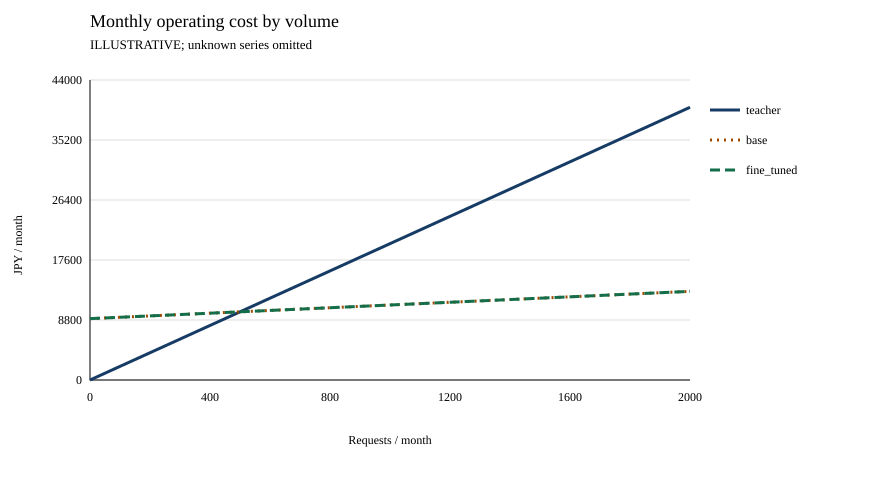

# Foundry Distillation Lab

日本語の小売・購入後サポートで、**蒸留は本当に役立つか**を品質・時間・総費用から調べる実験教材です。LLM APIの利用経験がある開発者向けの、書籍の章立てに対応する実装とガイドです。書籍の完成原稿ではありません。

**蒸留**とは、強いモデル（teacher）の振る舞いを手本に、別のモデル（student）へ特定の仕事を学習させることです。この教材では、Microsoft Foundryで得たteacherの回答・ツール呼び出し履歴を選別し、studentを教師ありファインチューニング（SFT）します。teacherの重み・内部の思考・仕組みをコピーするものではありません。小さなモデルで品質を維持し、待ち時間や費用を減らすことが目的ですが、**成功は前提にしません**。未学習studentが最良、学習後に悪化、判断保留も正当な結果です。

> **独立した学習用リポジトリであり、Microsoft公式教材・製品サポートではありません。**
> クラウドでの学習・推論・デプロイは未検証・未実施です。公開準備やオフライン実行の承認は、クラウド支出の承認ではありません。

## 最初の問い

説明用にteacherを20円/件、studentを2円/件＋月固定9,000円と置くと、月500件で運用費が同額です。月1,000件なら月9,000円の差があります。追加初期費用18,000円を回収するには2か月かかります。**すべて架空の値で、Azure料金でも実測成績でもありません。** studentの品質が足りなければ、この費用差だけで採用しません。



同額のbaseとfine_tunedは線が重なります。[入力・数表・累積費用・投資回収図](examples/illustrative/README.md)を併読してください。

## オフラインから始める（Windows / PowerShell）

新しいリポジトリのルートで実行します。初版の確認対象はWindows / PowerShell、確認に使用するPythonは3.13です。パッケージ宣言はPython **3.11以上**ですが、全対応版・macOS・Linuxの実行確認を意味しません。

```powershell
py -3.13 -m venv .venv
.\.venv\Scripts\python.exe -m pip install -e .
.\.venv\Scripts\python.exe -m unittest discover -s tests
.\.venv\Scripts\python.exe scripts\prepare_data.py --input data\samples\traces.jsonl --output runs\data --seed 42
.\.venv\Scripts\python.exe scripts\evaluate.py --mode next-action --prepare-next-actions --input runs\data\next-actions.jsonl --output runs\next-action-input.json
.\.venv\Scripts\python.exe scripts\evaluate.py --mode next-action --input data\samples\evaluation-next-action.json --output runs\next-action-scores.json
.\.venv\Scripts\python.exe scripts\evaluate.py --mode e2e --input data\samples\evaluation-e2e.json --output runs\e2e-scores.json
.\.venv\Scripts\python.exe scripts\report.py --input examples\illustrative\cost-input.json --output runs\cost-example
```

インストール時のパッケージ取得にはネットワークが必要になり得ます。データ準備・費用レポート・標準テスト自体はクラウド資格情報不要です。以降の`python`はこの仮想環境のPythonを指します（有効化せず、上のフルパスに置き換えても構いません）。出力先は新規ディレクトリを指定してください。既存結果を消して再利用するのでなく、新しいrun名を選びます。

`data\samples\traces.jsonl`は架空店舗の日本語配送問い合わせ20件を**スクリプトで構成した説明用データ**です。teacherが生成した履歴でも、モデル性能の証拠でもありません。`prepare_data.py`は`train.jsonl`、`validation.jsonl`、`development.jsonl`、`final.jsonl`と監査・manifestを生成します。配送の1カテゴリだけなので網羅性はありません。manifestの`quality_review_approved: false`は意図的な未承認状態であり、業務・プライバシーレビューと有料実行承認を省略できません。

`evaluation-next-action.json`と`evaluation-e2e.json`も合成の採点練習用bundleです。保存済みの模擬応答を採点するだけで、モデルへ推論しません。評価出力と費用入力は別スキーマですが、次の限定adapterでusage・最終判定を転記せず接続できます。価格・固定費・初期費用・運用件数は別の明示的な設定で与えます。

```powershell
.\.venv\Scripts\python.exe scripts\report.py --prepare-evaluation --input runs\e2e-scores.json --config configs\examples\cost-evaluation.json --output runs\evaluation-cost-input.json
.\.venv\Scripts\python.exe scripts\report.py --input runs\evaluation-cost-input.json --output runs\evaluation-cost-report
```

未知の価格/usageは`null`、未確認の成功単価は未定義のままです。全予定ケースを分母にし、既知usageの小計を総量にしません。cohort・反復数・runtimeが一致しない比較は保留します。合成データやローカル直接推論がHosted Agent/本番の実績へ昇格することはなく、上の例も採用の証拠にはなりません。[接続契約](examples/illustrative/README.md#評価レポートから費用入力を準備する)を確認してください。

`--prepare-next-actions`は分割データを評価用bundleへ変換するだけです。`runs\next-action-input.json`は`records: []`で予測を含まず、`unreviewed_cases_no_predictions`と表示します。その後の採点練習コマンドは別の合成サンプルを使います。空のbundleを採点しても、正解から予測を捏造せず全予定枠を未記録として扱います。

```powershell
.\.venv\Scripts\python.exe scripts\evaluate.py --help
.\.venv\Scripts\python.exe scripts\collect.py --help
.\.venv\Scripts\python.exe scripts\train.py --help
.\.venv\Scripts\python.exe scripts\deployment.py --help
```

`--help`はクラウド接続確認ではありません。まず各入口のオフライン計画・検証経路を読み、有料操作の手前で止めます。`collect.py`の通常経路は保存済みtraceのimportと計画作成です。別途承認を要求する`--invoke`は将来のHosted Agent呼出し用azd wrapperで、今回未実行・cloud未検証です。`evaluate.py --send`の対象はローカルrunnerからの直接モデル推論であり、Hosted Agent経由の業務評価が検証済みという意味ではありません。

## 全工程と読む順序

業務・評価基準を固定 → teacher履歴を収集・検査 → 重複を跨がせず分割 → teacher/baseを評価 → SFT → fine_tunedを同条件で評価 → 業務全体を人間確認 → 費用と採用判断、の順です。品質不合格なら費用が安くても採用しません。途中の費用・データ不足なら保留します。

| 章 | 現在地・実行入口 | 主な出力と判断 |
|---|---|---|
| [01 蒸留と目的](docs/chapters/01-introduction.md) | 全工程を把握 | 仮想例と実測を区別 |
| [02 指標と実験設計](docs/chapters/02-measurement.md) | 3者・二段階の設計 | 品質ゲートと停止基準 |
| [03 小売業務](docs/chapters/03-retail.md) | 日本語contractと業務素材 | 正しい対応と不正操作の境界 |
| [04 環境と安全](docs/chapters/04-environment.md) | インストール、各`--help` | 予算・承認・所有権記録 |
| [05 teacher履歴と分割](docs/chapters/05-data.md) | `prepare_data.py`、`collect.py` | 分割・監査とholdout |
| [06 SFTと次の行動](docs/chapters/06-training.md) | `train.py`、`evaluate.py` | 評価①の差分 |
| [07 業務全体の評価](docs/chapters/07-end-to-end.md) | `evaluate.py`、`deployment.py` | 評価②・人間レビュー |
| [08 総費用](docs/chapters/08-cost.md) | `report.py` | CSV / JSON / SVG |
| [09 採用判断](docs/chapters/09-decision.md) | 生成された`decision.md` | 採用・条件付き・見送り・保留 |
| [10 振り返り](docs/chapters/10-lessons.md) | 実験記録 | 再評価計画と限界 |

日本語化済みプロンプト・6ツール・架空業務コードを正本として再利用します。基準日は教材内の**2026-08-31**に固定します。対象は**一つの顧客入力から複数のモデル/ツール呼び出しを行い、回答・処理または必要な確認質問を返すこと**です。顧客の反復対話シミュレーターはありません。

## 検証範囲チェックリスト

- [x] Windows / Python 3.13.15のクリーンな`.venv`へeditable installし、コアの14テストを実行（標準依存のみ）。
- [x] 費用計算のオフライン単体テストをWindows / Python 3.13で実行（cache内数、未知値、500件交点、2か月回収、上書き拒否）。
- [x] 架空値のレポートCLIを単体テストから実行。
- [x] スクリプト作成データのimport・準備CLIと、合成bundleの評価①/②のオフライン採点CLIを実行（モデル性能は未測定）。
- [x] 学習upload計画とモデル配置計画のオフライン生成を実行（送信・配置は未実施）。
- [x] 評価report→費用入力adapter、欠測・case/tool/cohort/runtime不一致の保留、fresh reviewのhash照合、公開図表の不変性を含む統合オフライン166テストを実行。公開対象だけのGit index exportと新規`.venv`でも再確認。
- [x] [GitHub Actions上のWindows workflow](https://github.com/shitada/foundry-distillation-lab/actions/workflows/offline.yml)でテスト・データ準備・説明用レポート・公開対象検査を実行。
- [ ] クラウドの認証・リージョン・モデル利用可否・quotaの現地確認。
- [ ] 有料teacher収集、SFT、モデル/agent配置、実推論の通し検証。
- [ ] Hostedの実ツール実行とSDKコンテキスト上のcall IDの対応確認。現行captureの名前・引数からの照合は診断用で、これだけの証跡ではツール使用ケースを成功判定しない。
- [ ] 独立最終holdoutによる品質同等性・費用優位性の実証。

チェック済みは限定された確認範囲です。[確認記録](docs/reference/verification.md)を参照してください。統合テストはオフライン処理とmock境界の確認であり、クラウド互換性・性能・費用優位性の実証ではありません。利用時は上の手順を実行し、そのrunの結果を記録してください。旧実験の結果をこのリポジトリの実績として流用しません。Preview APIとSDKの組合せは変化します。コントロール側とHosted Agent側の依存を混ぜず、live検証前に公式の対応表と実際の版を確認してください。廃止されたStored Completionsを既定経路にはしません。

## 安全・資料・出典

- [費用入力スキーマ](examples/illustrative/README.md) / [実測用テンプレート](configs/examples/cost-actual-template.json)：`null`は不明であり0ではありません。
- [エージェントへの依頼例](docs/assistance.md) / [トラブルシューティング](docs/troubleshooting/README.md)：合格させるために期待値を変えない。
- [承認・journalの安全契約](docs/reference/safety.md)：送信前に記録し、結果不明時は再送せず照合する。
- [クラウド実行境界](docs/reference/cloud-execution.md) / [Hosted Agent追試の前提](deploy/hosted-agent/README.md)：SDK・protocol・identity・永続volumeは未検証。単一replicaが前提で、ARM条件付き操作の保証確認前に共有資源へ実行しない。
- `runs\`はローカル証跡用。認証cache、個人endpoint、承認記録、生ログ、学習済みartifactを公開しません。
- 有料学習と推論はそれぞれ件数・金額・期限を計画し、**小規模試行も別途明示承認**します。ローカル処理停止だけではクラウド課金は止まりません。
- 上流：[microsoft-foundry/fine-tuning — TracesDistillation](https://github.com/microsoft-foundry/fine-tuning/tree/main/Demos/TracesDistillation)。
- 公式資料：[fine-tuning considerations](https://learn.microsoft.com/azure/foundry/openai/concepts/fine-tuning-considerations)、[fine-tuning data generation](https://learn.microsoft.com/azure/foundry/fine-tuning/data-generation)。最新の制限は実行前に再確認します。
- ライセンス・移植元の詳細はルートの`LICENSE`、`THIRD_PARTY_NOTICES.md`と[出典記録](docs/reference/provenance.json)を参照してください。採用元commitのMIT表記をローカルgit objectで照合し、日本語contractと架空店舗素材の元のバイト列を保持しています。上流の現在のHEADを取得できたとの主張ではありません。本リポジトリの新規コード・教材文はMIT扱いです。将来の書籍原稿の権利条件は別に定めます。
