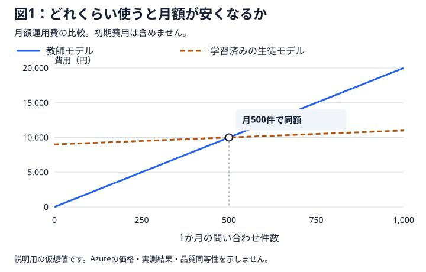
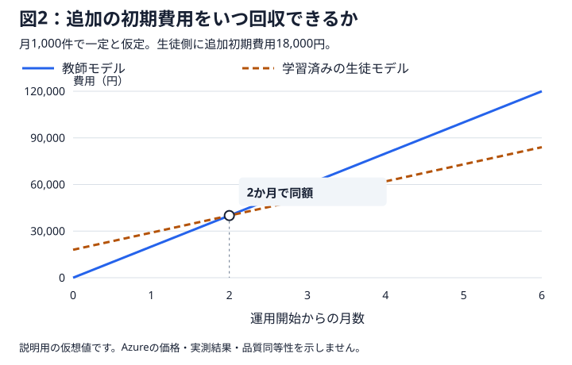

# Foundry Distillation Lab

日本語の小売・購入後サポートで、**蒸留は本当に役立つか**を品質・時間・総費用から調べる実験教材です。LLM APIの利用経験がある開発者向けの、書籍の章立てに対応する実装とガイドです。書籍の完成原稿ではありません。

**蒸留**とは、強いモデル（teacher）の振る舞いを手本に、別のモデル（student）へ特定の仕事を学習させることです。この教材では、Microsoft Foundryで得たteacherの回答・ツール呼び出し履歴を選別し、studentを教師ありファインチューニング（SFT）します。teacherの重み・内部の思考・仕組みをコピーするものではありません。小さなモデルで品質を維持し、待ち時間や費用を減らすことが目的ですが、**成功は前提にしません**。未学習studentが最良、学習後に悪化、判断保留も正当な結果です。

> **独立した学習用リポジトリであり、Microsoft公式教材・製品サポートではありません。**
> クラウドでの学習・推論・デプロイは未検証・未実施です。公開準備やオフライン実行の承認は、クラウド支出の承認ではありません。

## 蒸留したモデルは、いつ安くなるのか

費用を考えるときは、**「月額運用費が安くなる利用量」と「追加の初期費用を回収する期間」**を分けます。まずは単純な例で違いを確認しましょう。

> 以下の金額は、考え方を説明するための仮想値です。Azureの実際の料金でも、本教材で得た実測結果でもありません。また、両モデルが必要な品質を満たすと仮定した費用比較であり、品質が同じだと実証したものではありません。

### 1. 月額運用費の分岐点

問い合わせ1件は、ツール操作や途中のモデル呼び出しを含めた**一つの業務処理全体**とします。モデルを1回呼び出すこととは区別してください。

| 説明用の仮定 | 教師モデル | 学習済みの生徒モデル |
| --- | ---: | ---: |
| 問い合わせ1件あたりの従量費 | 20円 | 2円 |
| 月額固定費 | 0円 | 9,000円 |

生徒モデルは1件あたりの費用が低い一方、利用が少なくても月額固定費がかかります。この仮定では、月500件でどちらも10,000円となり、**月500件を超えると生徒モデルの月額運用費が安くなります。**

| 月間問い合わせ件数 | 教師モデルの月額 | 学習済みの生徒モデルの月額 |
| ---: | ---: | ---: |
| 100件 | 2,000円 | 9,200円 |
| 500件 | 10,000円 | 10,000円 |
| 1,000件 | 20,000円 | 11,000円 |

この図には初期費用を含めていません。また、説明を単純にするため、両者に同額でかかる共通費は省略しています。実際の比較では、モデルの稼働費だけでなく、エージェント基盤、ツール、ログなどの費用も確認します。

### 2. 追加の初期費用を回収するまでの期間

次に、月1,000件の問い合わせが継続し、生徒モデルを導入するために、データ準備・学習・評価などの**追加初期費用として18,000円**かかったとします。両案に共通する初期費用は、この例では差し引いています。

月額運用費は、教師モデルが20,000円、生徒モデルが11,000円なので、月9,000円ずつ差がつきます。ただし、生徒モデル側は18,000円を先に支払っています。

| 運用開始からの期間 | 教師モデルの累積費用 | 学習済みの生徒モデルの累積費用 |
| ---: | ---: | ---: |
| 開始時 | 0円 | 18,000円 |
| 1か月後 | 20,000円 | 29,000円 |
| 2か月後 | 40,000円 | 40,000円 |
| 3か月後 | 60,000円 | 51,000円 |

この条件が続けば、**2か月後に追加初期費用を回収し、それ以降は初期費用を含めた総額でも生徒モデルが安くなります。** 月額が安いからといって、導入直後から総額も安いわけではありません。

利用が少ない、運用期間が短い、追加学習を繰り返す、失敗対応の費用が増える、といった場合には、回収できないこともあります。第8章では、このような図を実際の使用量と料金・運用条件を使って作り直します。

## 始め方

初めての方は、[第1章「蒸留と目的」](docs/chapters/01-introduction.md)から順に読んでください。最初の3章で蒸留・評価・題材となる業務を理解し、[第4章「環境と安全」](docs/chapters/04-environment.md)で実行環境を準備します。**読み始める前のインストールやAzure環境の用意は不要です。**

環境構築、データ準備、学習、評価、費用計算の操作は、それぞれの章で目的とともに説明します。先に一括実行する必要はありません。

出力例だけを先に見たい方は、[第1章の図と計算例](docs/chapters/01-introduction.md)を参照してください。このページと同じ説明用の見本で、実際の学習・推論や蒸留の効果を示す結果ではありません。

## 全工程と読む順序

業務・評価基準を固定 → 教師モデルの履歴を収集・検査 → 重複を跨がせず分割 → 学習前の生徒モデルを評価 → 教師ありファインチューニング → 学習済みの生徒モデルを同条件で評価 → 3者で業務全体を評価・人間確認 → 費用と採用判断、の順です。品質不合格なら費用が安くても採用しません。途中の費用・データ不足なら保留します。

| 章 | 現在地・実行入口 | 主な出力と判断 |
| --- | --- | --- |
| [01 蒸留と目的](docs/chapters/01-introduction.md) | 全工程を把握 | 仮想例と実測を区別 |
| [02 蒸留の効果をどう確かめるか](docs/chapters/02-measurement.md) | 評価の仕組みと結果の使い道を理解 | 比較対象・二つの評価・採用判断の関係 |
| [03 小売業務](docs/chapters/03-retail.md) | 日本語contractと業務素材 | 正しい対応と不正操作の境界 |
| [04 環境・実験条件と安全](docs/chapters/04-environment.md) | 実行環境と実験計画を準備 | 比較条件・判断基準・予算・承認・停止条件 |
| [05 教師の履歴と分割](docs/chapters/05-data.md) | `prepare_data.py`、`collect.py` | 分割・監査と最終評価用データの管理 |
| [06 追加学習と次の行動](docs/chapters/06-training.md) | `train.py`、`evaluate.py` | 評価①の学習前後の差分 |
| [07 業務全体の評価](docs/chapters/07-end-to-end.md) | `evaluate.py`、`deployment.py` | 評価②・人間レビュー |
| [08 総費用](docs/chapters/08-cost.md) | `report.py` | CSV / JSON / SVG |
| [09 採用判断](docs/chapters/09-decision.md) | 生成された`decision.md` | 採用・条件付き・見送り・保留 |
| [10 振り返り](docs/chapters/10-lessons.md) | 実験記録 | 再評価計画と限界 |

日本語化済みプロンプト・6ツール・架空業務コードを正本として再利用します。基準日は教材内の**2026-08-31**に固定します。対象は**一つの顧客入力から複数のモデル/ツール呼び出しを行い、回答・処理または必要な確認質問を返すこと**です。顧客の反復対話シミュレーターはありません。

## 検証範囲チェックリスト

- [ ] Windows / Python 3.13.15のクリーンな`.venv`へeditable installし、コアの14テストを実行（標準依存のみ）。
- [ ] 費用計算のオフライン単体テストをWindows / Python 3.13で実行（cache内数、未知値、500件交点、2か月回収、上書き拒否）。
- [ ] 架空値のレポートCLIを単体テストから実行。
- [ ] スクリプト作成データのimport・準備CLIと、合成bundleの評価①/②のオフライン採点CLIを実行（モデル性能は未測定）。
- [ ] 学習upload計画とモデル配置計画のオフライン生成を実行（送信・配置は未実施）。
- [ ] 評価report→費用入力adapter、欠測・case/tool/cohort/runtime不一致の保留、fresh reviewのhash照合、公開図表の不変性を含む統合オフライン166テストを実行。公開対象だけのGit index exportと新規`.venv`でも再確認。
- [ ] [GitHub Actions上のWindows workflow](https://github.com/shitada/foundry-distillation-lab/actions/workflows/offline.yml)でテスト・データ準備・説明用レポート・公開対象検査を実行。
- [ ] クラウドの認証・リージョン・モデル利用可否・quotaの現地確認。
- [ ] 有料teacher収集、SFT、モデル/agent配置、実推論の通し検証。
- [ ] Hostedの実ツール実行とSDKコンテキスト上のcall IDの対応確認。現行captureの名前・引数からの照合は診断用で、これだけの証跡ではツール使用ケースを成功判定しない。
- [ ] 独立最終holdoutによる品質同等性・費用優位性の実証。

チェック済みは限定された確認範囲です。[確認記録](docs/reference/verification.md)を参照してください。統合テストはオフライン処理とmock境界の確認であり、クラウド互換性・性能・費用優位性の実証ではありません。利用時は本編の各章に沿って実行し、そのrunの結果を記録してください。旧実験の結果をこのリポジトリの実績として流用しません。Preview APIとSDKの組合せは変化します。コントロール側とHosted Agent側の依存を混ぜず、live検証前に公式の対応表と実際の版を確認してください。廃止されたStored Completionsを既定経路にはしません。

## 安全・資料・出典

- [費用入力スキーマ](examples/illustrative/README.md) / [実測用テンプレート](configs/examples/cost-actual-template.json)：`null`は不明であり0ではありません。
- [エージェントへの依頼例](docs/assistance.md) / [トラブルシューティング](docs/troubleshooting/README.md)：合格させるために期待値を変えない。
- [承認・journalの安全契約](docs/reference/safety.md)：送信前に記録し、結果不明時は再送せず照合する。
- [クラウド実行境界](docs/reference/cloud-execution.md) / [Hosted Agent追試の前提](deploy/hosted-agent/README.md)：SDK・protocol・identity・永続volumeは未検証。単一replicaが前提で、ARM条件付き操作の保証確認前に共有資源へ実行しない。
- `runs\`はローカル証跡用。認証cache、個人endpoint、承認記録、生ログ、学習済みartifactを公開しません。
- 有料学習と推論はそれぞれ件数・金額・期限を計画し、**小規模試行も別途明示承認**します。ローカル処理停止だけではクラウド課金は止まりません。
- 参照元リポジトリ：[microsoft-foundry/fine-tuning — TracesDistillation](https://github.com/microsoft-foundry/fine-tuning/tree/main/Demos/TracesDistillation)。
- 公式資料：[fine-tuning considerations](https://learn.microsoft.com/azure/foundry/openai/concepts/fine-tuning-considerations)、[fine-tuning data generation](https://learn.microsoft.com/azure/foundry/fine-tuning/data-generation)。最新の制限は実行前に再確認します。
- ライセンス・移植元の詳細はルートの`LICENSE`、`THIRD_PARTY_NOTICES.md`と[出典記録](docs/reference/provenance.json)を参照してください。採用元commitのMIT表記をローカルgit objectで照合し、日本語contractと架空店舗素材の元のバイト列を保持しています。参照元リポジトリの現在のHEADを取得できたとの主張ではありません。本リポジトリの新規コード・教材文はMIT扱いです。将来の書籍原稿の権利条件は別に定めます。
