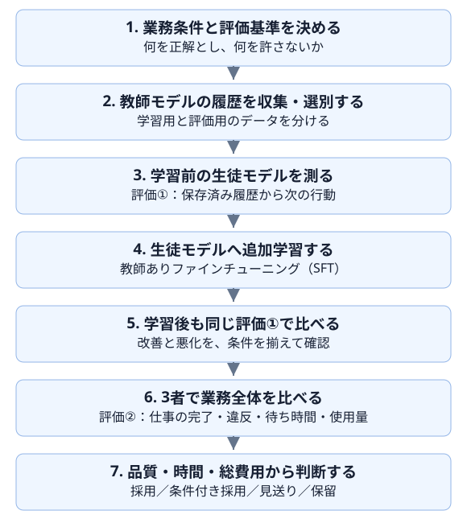

# 01 蒸留で何を達成したいか

## この章の目的

蒸留の仕組みと目的を理解し、**必要な品質を保ちながら、待ち時間や総費用を減らせるか**を判断するための全体像をつかみます。この章では考え方を整理し、環境構築や学習は後の章で行います。

## 蒸留とは何か

### 教師モデルの振る舞いを、生徒モデルに学ばせる

**蒸留（知識蒸留）**は、あるモデルの出力などを手本にして、別のモデルへ特定の仕事の振る舞いを学習させる方法です。一般には、高性能で大きなモデルから、小さく効率のよいモデルへ能力を移すために用いられます。[1][2]

手本を作る側を**教師モデル（teacher）**、その手本から学ぶ側を**生徒モデル（student）**と呼びます。この教材では、教師モデルが小売サポートで行った回答やツール操作を学習例として使います。

例えば、返品について問い合わせを受けた教師モデルが、注文情報と返品条件を確認してから対応を提案したとします。生徒モデルには、その入力と一連の振る舞いを示し、「どの情報を確かめ、どのツールへ何を渡し、どう回答するか」を学ばせます。

ここでいう**ツール**とは、注文照会や在庫確認、返金額の計算などを行うプログラムです。蒸留するのは主にその使い方であり、注文データベースや計算プログラム自体をモデルの中へコピーするわけではありません。

### なぜ蒸留するのか

高性能なモデルをそのまま使うことが、常に最適とは限りません。対象の仕事が絞られているなら、小型モデルへその仕事を学習させることで、必要な品質を保ちつつ、推論の費用や待ち時間を減らせる可能性があります。[1]

ただし、小型モデルに追加学習をすれば必ず成功するわけではありません。品質が下がる、処理を何度も繰り返して遅くなる、学習費や固定費を含めると割高になる、といった結果もあり得ます。**蒸留すること自体ではなく、仕事に適した構成を見つけることが目的です。**

### この教材で行う蒸留

蒸留には複数の方法があります。教師モデルと生徒モデルの出力候補の確率を近づける方法もあり、Hugging Faceの公式ガイドでは画像分類を例に紹介されています。[2] 本教材ではその方式を直接実装するのではなく、教師モデルが生成した回答・ツール操作の履歴を使います。

Microsoft Foundryでは、大きなモデルの出力を学習データとして、小さなモデルをファインチューニングする方法が蒸留として説明されています。[1] 本教材では、履歴を確認・選別したうえで、**教師ありファインチューニング**を行います。

教師ありファインチューニングとは、既に学習済みのモデルに、入力と望ましい出力の例を与えて、特定の仕事に適するよう追加学習することです。Hugging Faceの言語モデル向け公式資料でも、入力と出力の組や会話形式のデータを使う学習方法として説明されています。[3]

**教師モデルの出力は、そのまま正解になるわけではありません。** 誤った返金や確認漏れを含む履歴まで手本にしないよう、業務ルールと実際のツール結果を照合します。教師モデルの内部パラメーターや非公開の思考を複製するものでも、あらゆる能力を移植するものでもありません。

## 読み進めるための前提

Pythonなどのプログラムから、生成モデルへ文章を送り、回答を受け取った経験がある読者を想定しています。例えば、Azure OpenAIのモデルを呼び出して、問い合わせ文への回答を取得するような操作です。

ここでいう**アプリケーションプログラミングインターフェース**（API）は、そのようにプログラムからモデルの機能を利用するための窓口を指します。一般的な業務システムの操作用インターフェースではなく、ここでは**生成モデルに推論を依頼するためのもの**です。

蒸留や追加学習の経験は必要ありません。この章を読むためのインストールやクラウド環境の用意も不要です。具体的な準備は第4章で行います。

## 蒸留と評価の実践の流れ

実践では、学習を始める前に、対象業務と評価の基準を決めます。その後、学習前後の変化を測り、最後に業務全体と総費用を比較します。

この流れで比較するのは、次の3者です。

| 比較対象 | 役割 | 比較して分かること |
|---|---|---|
| 教師モデル | 学習の手本を作る、高性能なモデル | 置き換え元としての品質・待ち時間・費用 |
| 学習前の生徒モデル | 今回の業務向け追加学習をしていないモデル | 小型モデルをそのまま使った場合の実力 |
| 学習済みの生徒モデル | 選別した教師の履歴で追加学習したモデル | 追加学習による改善・悪化と、その費用 |

「学習前」は**今回の業務向け追加学習の前**という意味です。一般的な言語知識を持たない、ゼロからのモデルという意味ではありません。学習前の生徒モデルで必要な品質を満たすなら、追加学習をしない選択もできます。

具体的な使用モデルの例と選び方は、[第4章の「教師モデルと生徒モデルを選ぶ」](04-environment.md#教師モデルと生徒モデルを選ぶ)で説明します。

評価では、**「途中の一つの判断」と「問い合わせへの対応全体」**を分けて確かめます。

- **評価①：この場面で、次に何をするか。** 例えば「注文情報と返品条件を確認したところ」という同じ場面を各モデルに示し、次に取る行動を比べます。実際に処理を進めるのではなく、学習前後で判断がどう変わったかを調べます。
- **評価②：問い合わせを受けてから、適切に回答できるか。** 同じ問い合わせと業務上の条件から始め、必要な確認やツール操作を各モデル自身に任せます。最終的な対応だけでなく、途中の誤りや処理時間も確認します。

評価①は「用意された場面での判断」、評価②は「自分で進めた対応全体」の評価です。一つの場面で正しく判断できても、その後の対応までうまくいくとは限らないため、両方を確認します。ルール検査と採点用モデルで自動採点し、利用者は比較表の代表例を読みます。この自動判定と、人が確認した業務成功や最終的な採用判断は分けます。具体的な進め方や採点方法は、第2章以降で詳しく説明します。

## 蒸留したモデルは、いつ安くなるのか

費用を考えるときは、**「月額運用費が安くなる利用量」と「追加の初期費用を回収する期間」**を分けます。まずは単純な例で違いを確認しましょう。

> 以下の金額は、考え方を説明するための仮想値です。Azureの実際の料金でも、本教材で得た実測結果でもありません。また、両モデルが必要な品質を満たすと仮定した費用比較であり、品質が同じだと実証したものではありません。

### 1. 月額運用費の分岐点

問い合わせ1件は、ツール操作や途中のモデル呼び出しを含めた**一つの業務処理全体**とします。モデルを1回呼び出すこととは区別してください。

| 説明用の仮定 | 教師モデル | 学習済みの生徒モデル |
|---|---:|---:|
| 問い合わせ1件あたりの従量費 | 20円 | 2円 |
| 月額固定費 | 0円 | 9,000円 |

生徒モデルは1件あたりの費用が低い一方、利用が少なくても月額固定費がかかります。この仮定では、月500件でどちらも10,000円となり、**月500件を超えると生徒モデルの月額運用費が安くなります。**

| 月間問い合わせ件数 | 教師モデルの月額 | 学習済みの生徒モデルの月額 |
|---:|---:|---:|
| 100件 | 2,000円 | 9,200円 |
| 500件 | 10,000円 | 10,000円 |
| 1,000件 | 20,000円 | 11,000円 |

この図には初期費用を含めていません。また、説明を単純にするため、両者に同額でかかる共通費は省略しています。実際の比較では、モデルの稼働費だけでなく、エージェント基盤、ツール、ログなどの費用も確認します。

### 2. 追加の初期費用を回収するまでの期間

次に、月1,000件の問い合わせが継続し、生徒モデルを導入するために、データ準備・学習・評価などの**追加初期費用として18,000円**かかったとします。両案に共通する初期費用は、この例では差し引いています。

月額運用費は、教師モデルが20,000円、生徒モデルが11,000円なので、月9,000円ずつ差がつきます。ただし、生徒モデル側は18,000円を先に支払っています。

| 運用開始からの期間 | 教師モデルの累積費用 | 学習済みの生徒モデルの累積費用 |
|---:|---:|---:|
| 開始時 | 0円 | 18,000円 |
| 1か月後 | 20,000円 | 29,000円 |
| 2か月後 | 40,000円 | 40,000円 |
| 3か月後 | 60,000円 | 51,000円 |

この条件が続けば、**2か月後に追加初期費用を回収し、それ以降は初期費用を含めた総額でも生徒モデルが安くなります。** 月額が安いからといって、導入直後から総額も安いわけではありません。

利用が少ない、運用期間が短い、追加学習を繰り返す、失敗対応の費用が増える、といった場合には、回収できないこともあります。第8章では、このような図を実際の使用量と料金・運用条件を使って作り直します。

## この章で整理すること

ここまでの説明を踏まえて、後の章で実験条件を具体化するための**実験目標のメモ**を作ります。ここでいう出力は、学習済みモデルや評価レポートではなく、「何を確かめたいか」を整理したものです。

| メモする項目 | 小売サポートでの例 |
|---|---|
| 任せたい仕事 | 注文と返品条件を確認し、許可された対応を提案・実行する |
| 利用量と運用期間 | 月に何件の問い合わせがあり、何か月使う見込みか |
| 費用面で確かめたいこと | 固定費込みで安くなる件数と、初期費用を回収できる期間 |
| 守るべき品質 | 顧客が承認していない返金を実行しない。必要な確認を省かない |
| 待ち時間の条件 | 1件の処理で許容する待ち時間を考える |

まだ根拠のない項目は、確定値にせず「仮定」や「未定」と書きます。具体的な品質基準や予算は、[第4章](04-environment.md)以降で測定・確認できる形にしていきます。

## 結果を読むときの考え方

上の二つのグラフは、費用の仕組みを理解するための図です。実際の採用判断では、まず業務の必要品質や重大な違反の有無を確認し、そのうえで待ち時間と総費用を比べます。

例えば、処理を途中で諦めたために使用量が少なかったモデルを、「安く仕事を完了した」と評価してはいけません。費用が低くても品質を満たさなければ採用を見送り、評価件数や費用の根拠が足りなければ判断を保留します。

また、未学習の生徒モデルで十分な場合は、学習しない構成も候補になります。**蒸留が成功する筋書きに合わせるのではなく、比較から得られた結果に合わせて判断する**ことが、この教材の基本方針です。

## 完了条件

次の内容を、自分の言葉で説明できれば次章へ進みます。

- 教師モデルと生徒モデルの役割、および蒸留で何を学習させるのか。
- この教材で用いる教師ありファインチューニングと、教師の履歴を選別する理由。
- 教師モデル・学習前の生徒モデル・学習済みの生徒モデルを比較する理由。
- 次の行動を測る評価①と、業務全体を測る評価②の違い。
- 月額運用費の分岐点と、追加初期費用の回収期間の違い。
- 仮想のグラフだけでは品質や採用可否を判断できない理由。

加えて、実験目標のメモに、対象業務・必要品質・待ち時間・利用量・運用期間・費用の問いを、現時点の仮定として記録できていることを確認します。

## この章の範囲と限界

ここでは蒸留の考え方と実験の全体像までを扱います。学習アルゴリズムの詳しい数式、モデルや地域ごとの利用条件、実際の価格設定は扱いません。Foundryで利用できるモデルや機能は実行時に確認します。

また、小売サポートの限られたケースで学んだ振る舞いが、別の業務や実際の顧客全体でも通用するとは限りません。教材内の成功と、本番への適用判断を区別してください。

## リファレンス

以下はいずれも提供元の公式資料です。2026年9月21日に内容を確認しました。本文は資料を参考に本教材向けに説明し直したもので、掲載した費用は資料の価格を引用したものではありません。

1. **[Microsoft Learn — Microsoft Foundry fine-tuning considerations](https://learn.microsoft.com/azure/foundry/openai/concepts/fine-tuning-considerations)**

   蒸留の位置付け、教師ありファインチューニング、追加の学習・ホスティング費、データ品質や適用範囲の制約を参照。
2. **[Hugging Face Transformers — Knowledge distillation for computer vision](https://huggingface.co/docs/transformers/tasks/knowledge_distillation_for_image_classification)**

   教師モデルから生徒モデルへ振る舞いを移す基本的な考え方と、蒸留方式の一例を参照。画像分類のガイドであり、本教材の言語モデル向け実行手順や性能を裏付けるものではありません。
3. **[Hugging Face — 教師ありファインチューニング用トレーナー](https://huggingface.co/docs/trl/sft_trainer)**

   言語モデルへの教師ありファインチューニングで用いる入力・出力の組と会話形式の学習データの説明を参照。ライブラリの具体的な利用手順は本章では扱いません。
