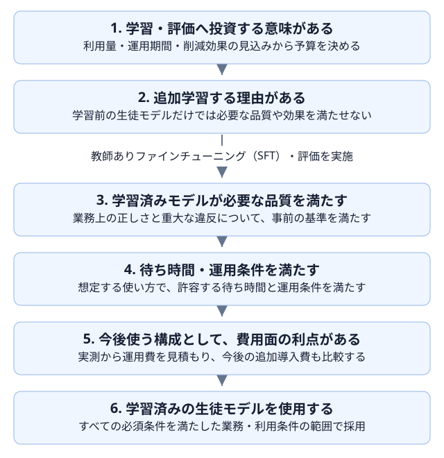
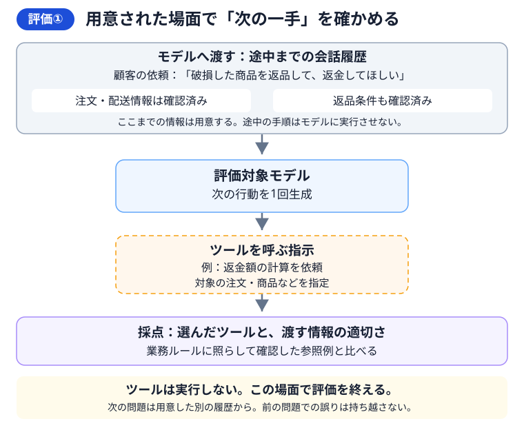

# 02 蒸留の効果をどう確かめるか

## この章の目的

第1章では、蒸留の効果を品質・待ち時間・総費用から判断する考え方を説明しました。この章では、それらを比較するために、何を測り、どのような基準で結果を判断するかを具体化します。

## まず、比較から何を知りたいかを決める

蒸留したモデルの点数だけを見ても、学習に意味があったのか、教師モデルを置き換えられるのかは分かりません。第1章で紹介した3者を、次の問いに対応させて比べます。

| 比べる組み合わせ | 確かめたいこと |
|---|---|
| 学習前と学習済みの生徒モデル | 今回の追加学習で、何が改善し、何が悪化したか |
| 教師モデルと学習済みの生徒モデル | 必要な品質を満たしたうえで、待ち時間や総費用を減らせるか |
| 教師モデルと学習前の生徒モデル | そもそも追加学習をせず、小型モデルをそのまま使えないか |

ここでいう「学習前」は、今回の小売業務向けに追加学習する前という意味です。一般的な言語知識を持たないモデルではありません。

**教師ありファインチューニング**（SFT）を行った構成が、必ず一番よいとは限りません。学習前の生徒モデルが必要な品質を満たすなら、追加の学習費を払わずに使う選択も評価の対象にします。

## 蒸留を試す条件と、採用する条件を分ける

学習を始める前に決めるのは、**学習・評価へ投資する意味があるか**です。学習を終えた後に決めるのは、**得られたモデルを今後使うべきか**です。この二つを分けて考えます。

今回は、必要な品質を保ちながら費用を削減することを目指し、次の順に条件を確認します。最初の条件を通過しただけで採用を決めず、すべての必須条件を満たした場合に、学習済みの生徒モデルを使います。

①・②は学習前の判断です。利用量が少ない、運用期間が短いなどの理由で費用削減の見込みが乏しければ、無理に蒸留を始めません。学習前の生徒モデルで必要な品質と期待する効果を満たせる場合も、追加学習なしの構成を検討します。

②と③の間で、教師ありファインチューニングと評価を実施します。③〜⑤は、得られた結果を**品質 → 待ち時間・運用条件 → 今後の費用**の順に確認するものです。別々の有料実験を3回行うという意味ではありません。

> **途中の条件を満たさない場合は、学習済みモデルの採用を見送ります。根拠が足りない場合は判断を保留します。**
> 代わりに、必要条件を満たす元のモデルや、学習前の生徒モデルを使うことを検討します。

「すべての条件を満たす」は、すべての指標で教師モデルを上回るという意味ではありません。必要な品質、許容する待ち時間、求める費用削減など、**事前に決めた必須条件を満たすこと**です。

### 初期費用は、判断する時点を分けて扱う

- **学習前の①では**、これから支払う学習・評価費に投資する価値があるかを概算し、予算を決めます。
- **学習後の⑤では**、すでに支払った学習・評価費ではなく、今後の運用費と、これから必要になる追加導入費を比較します。
- **初期費用を含む投資回収は**、第1章の費用グラフと第8章の分析で扱います。事前の見込みを立て、実施後に投資全体の採算を振り返るためのものです。

実測すると、呼び出しや再試行が予想より増え、運用費が想定ほど下がらないこともあります。そのため、学習前に投資を決めていても、学習後の費用確認は必要です。一方、「すでに学習費を払ったから」という理由で、条件を満たさないモデルを採用してはいけません。

## 二つの評価を、返品対応の例で理解する

### なぜ、二つの評価が必要なのか

返品条件を確認し終えた場面で、「次に返金額を計算する」と判断できることと、最初の問い合わせから必要な確認を進めて対応を終えられることは、同じではありません。

学習によって個々の判断がどう変わったかを調べるには、同じ場面を与えて次の行動を比べます。一方、問い合わせへの対応全体が適切かを確かめるには、最初から回答までをモデルに任せて、その過程と結果を見ます。

本教材では、前者を**評価①**、後者を**評価②**と呼びます。同じ返品依頼を使って、二つの方法を見ていきましょう。

> 顧客の依頼：「破損した商品を返品して、返金してほしい」

以下の図は、**一つのモデルに対する評価の進め方**を示しています。モデル同士を比較するときは、同じ評価をそれぞれのモデルに行い、結果を比べます。

図では、灰色が事前に用意する情報、青がモデル、橙色がツールに関わる部分、紫が採点です。矢印で、情報と処理の流れを示します。

### 評価①：用意された場面で、次の判断を確かめる

注文・配送情報と返品条件を確認し終えた場面を用意します。評価対象モデルへ、**そこまでの会話履歴とツール結果**を渡し、次の行動を一回生成させます。

例えば「返金額を計算するツールを、この注文の商品について呼ぶ」という指示が出たら、選んだツールと渡そうとした情報が適切かを調べます。**ここではツールを実行せず、その場面の評価を終えます。** 図中の指示は、仕組みを説明するための例です。

別の場面を評価するときも、その問題のために用意した履歴から始めます。前の問題でモデルが間違えていても、その誤りは次の問題へ引き継ぎません。これにより、**各問題の判断を、前の問題での応答から切り離して確認できます。** 参照例は教師の履歴を無条件に正解とせず、業務ルールと照合しておきます。

### 評価②：問い合わせへの対応を、最初から任せる

評価対象モデルへ、顧客の最初の依頼を渡します。業務側には注文・在庫の初期状態と業務ルールを用意します。途中の確認済み履歴は渡さず、何を照会し、どう処理し、どう回答するかをモデル自身に任せます。

モデルがツールを選ぶと、**実際にそのツールを動かして結果を返します。** モデルはその結果を使い、次の行動を選びます。注文照会、返品条件の確認、金額計算などを経て、許可された対応と回答に到達できるかを確認します。返金処理は教材内の模擬処理で、実店舗のシステムは変更しません。

この評価では、途中で誤った判断をしても、評価側が正しい履歴へ差し替えることはありません。自分の判断と得られた結果が、次の判断へ引き継がれます。**最後の回答だけでなく、そこへ至る操作、処理時間、全呼び出しの使用量まで**確認します。

情報不足のケースでは、必要な確認質問で終了することも適切です。顧客が答えて何度も会話を続けるところまでは扱いません。

### この教材では、どのモデルに評価を行うか

ここまでの図は「どう測るか」の説明です。評価の方法自体は特定のモデル専用ではありません。本教材では、知りたいことに合わせて次の対象へ適用します。

| 評価 | 主に比較する対象 | 知りたいこと |
|---|---|---|
| 評価① | 学習前と学習済みの生徒モデル | 同じ場面での判断が、追加学習によってどう変わったか |
| 評価② | 教師モデル・学習前の生徒モデル・学習済みの生徒モデル | 一件の業務を任せる構成として、どれが適しているか |

評価①で使う教師由来の履歴や参照例と、教師モデル自体を新たに呼び出して測ることは別です。また、学習前後の評価を同時に実施する必要はありません。学習前の結果を保存し、学習後に同じ条件で測って比較します。具体的な実施手順は、第6章・第7章で説明します。

### それぞれの評価から、何が得られるか

| 評価 | 得られること | それだけでは分からないこと |
|---|---|---|
| 評価① | 同じ場面で、学習前後のツール選択や渡す情報がどう改善・悪化したか | 必要な情報を自分で集め、一件の対応を適切に終えられるか |
| 評価② | 対応全体の成功・失敗、重大な違反、処理時間、一件あたりの使用量 | 異なる途中経路の影響を除いて、同じ場面での判断がどう変わったか |

**評価①で判断の変化を調べ、評価②で仕事として使えるかを確かめます。** 評価①の改善だけで採用は決めません。評価②で確認した品質・待ち時間・使用量を、先ほどの採用条件に照らして判断します。

Microsoftの公式資料「[Agent evaluators](https://learn.microsoft.com/azure/foundry/concepts/evaluation-evaluators/agent-evaluators)」でも、最終結果と途中のツール操作を分けて評価する観点が紹介されています。本教材ではそれを参考に、学習前後の比較と業務全体の比較を設計しています。公式の評価機能と同じ手順・採点器を、そのまま使っているという意味ではありません。

## 評価結果を採用判断につなげる

二つの評価から得られた結果は、次の判断に使います。細かな指標の選び方や集計は、それぞれの実践章で確認します。

| 判断したいこと | 使う結果 | 詳しく実践する章 |
|---|---|---|
| 追加学習で判断が改善したか | 評価①の学習前後の比較 | [第6章](06-training.md) |
| 一件の業務を適切に扱えるか | 評価②の途中の操作と最終的な対応 | [第7章](07-end-to-end.md) |
| 許容する時間で対応できるか | 評価②で測定した処理時間 | [第7章](07-end-to-end.md) |
| 今後使う構成として費用面の利点があるか | 評価②の使用量と、料金・運用条件・今後の追加導入費 | [第8章](08-cost.md) |

評価①で改善が見られても、それだけで業務を任せられるとは判断しません。評価②で必要な品質と待ち時間を確認し、その条件を満たした候補について、今後の運用費と追加導入費を比較します。重大な違反は、ほかの成功で埋め合わせません。

また、少数のケースで成績が同じだっただけでは、業務全体で同じ品質だとは言い切れません。評価した範囲と、まだ分からないことを分けて判断します。最終的な採否と再評価の扱いは、[第9章](09-decision.md)で整理します。

こうした比較をするには、同じ仕事・条件・基準で試すこと、学習に使っていないデータで確かめること、失敗や未確認の結果も残すことが必要です。具体的な実験条件は[第4章](04-environment.md)以降で準備します。データの準備は[第5章](05-data.md)、測定・集計は第6〜8章で実践します。

## 完了条件

次の内容を、自分の言葉で説明できれば次章へ進みます。

- 学習前後の比較と、教師モデルとの比較が、それぞれ何を確かめるものか。
- 学習前の投資判断と、学習後の採用判断の違い、およびそれぞれで比較する費用。
- 必須条件を満たさない場合の見送りと、根拠が足りない場合の保留の違い。
- 評価①と評価②で、開始する場面・履歴・分かることがどう違うか。
- 得られた評価結果を、どの判断に使うのか。
- 同じ条件と学習に使っていないデータで比べ、失敗・未確認の結果も残す必要性。
- 成績がよいことと、十分な根拠を持って採用できることの違い。

## この章の範囲と限界

この章では、評価の全体像と結果の使い道を理解するところまでを扱います。実行環境・実験条件・判断基準の準備は第4章、データの分割は第5章、次の行動の評価は第6章、業務全体の評価は第7章、費用計算は第8章、最終判断は第9章で具体化します。採点コードや統計計算の実装には、ここでは踏み込みません。

また、ここに挙げた観点を設計しただけで、すべての項目が現在のコードで自動判定できるわけではありません。日本語の説明内容や、記録だけでは判断できない点には人による確認が必要です。評価方法の説明と、実環境での検証が完了していることは区別します。

## リファレンス

以下は提供元の公式資料です。2026年9月21日に内容を確認しました。評価観点とデータ分離の考え方を参照しており、掲載された機能やライブラリを本教材ですべて利用しているという意味ではありません。

1. **[Microsoft Learn — Agent evaluators](https://learn.microsoft.com/azure/foundry/concepts/evaluation-evaluators/agent-evaluators)**

   最終結果と途中の処理を分けて評価する考え方、ツール選択・引数・結果利用・業務完了などの評価観点を参照。一部の機能はプレビューであり、本教材の独自採点とは区別します。
2. **[scikit-learn — Common pitfalls: Data leakage](https://scikit-learn.org/stable/common_pitfalls.html#data-leakage)**

   学習用と評価用のデータを分け、評価用の情報をモデルの学習や選択へ混入させないという一般的な原則を参照。小売サポートや生成モデル専用の実装ガイドではありません。
