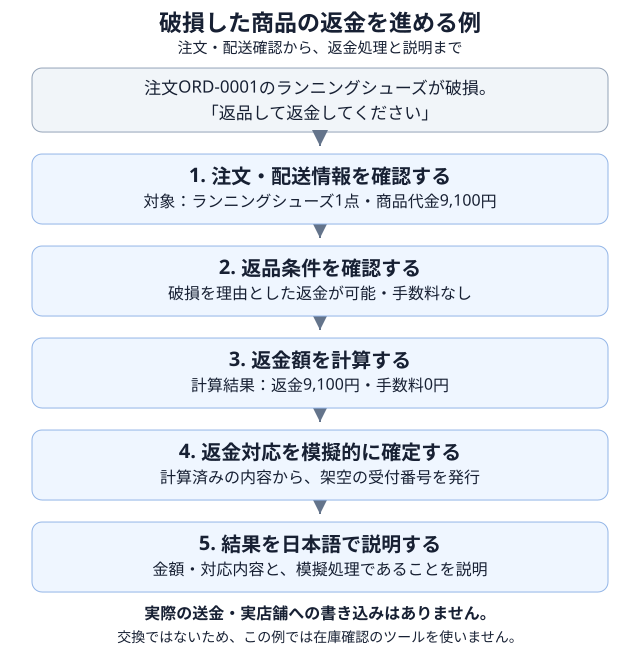

# 03 小売サポートで何をモデルに任せるか

## この章の目的

第1・2章で説明した蒸留と評価を、具体的な業務に結び付けます。日本語の小売サポートを題材に、**モデルが判断すること、ツールが処理すること、正しい対応の条件**を理解します。

## 題材は、商品を購入した後の問い合わせ対応

この教材では、架空の店舗「Zava」の購入後サポートを扱います。返品、交換、キャンセル、商品の紛失や配送遅延などの問い合わせを受け、注文状況と業務ルールに基づいて対応する仕事です。

例えば、顧客から「破損した商品を返品して、返金してほしい」と依頼された場合、自然な文章で返事をするだけでは足りません。どの注文の商品なのか、返金できる条件なのか、金額はいくらなのかを確認し、依頼された範囲で処理する必要があります。

使うのは、参照元の[TracesDistillationデモ](https://github.com/microsoft-foundry/fine-tuning/tree/2de8f491026472358919b35e473ab42393a686a7/Demos/TracesDistillation)を基に、日本語化した指示文・ツール定義・架空業務コードです。これらは本リポジトリに[収録済み](https://github.com/shitada/foundry-distillation-lab/tree/main/src/foundry_distillation_lab/retail)です。実験のたびに翻訳し直したり、参照元の最新版と同じ内容だと仮定したりせず、採用した版を共通の材料として使います。

**実顧客の情報や実店舗のシステムは使いません。** 返金や交換の確定も、教材内の模擬処理です。

## モデルの判断と、ツールの処理を分ける

モデルは、顧客の依頼と、それまでに得た情報から次の行動を選びます。注文情報の取得や返金額の計算は、モデルが文章として作り上げるのではなく、用意されたツールに依頼します。

| 担当 | この教材で行うこと |
|---|---|
| モデル | 何を確認するか、どのツールを使うか、どの注文・商品を対象にするか、どう回答するかを判断する |
| ツール | 指定された情報を使い、架空の注文・在庫を照会し、対応条件や金額を計算し、模擬処理の結果を返す |
| 業務ルール | 返品期限、交換の条件、手数料など、許される対応の基準を定める |

例えば、「返金額を計算する」という行動を選ぶのはモデルですが、計算結果を返すのはツールです。モデルはその結果を受け取って、次に確定処理へ進むか、顧客へ説明するかを判断します。

蒸留で学ばせたいのは、このような**情報の確認、ツールの選択、結果に基づく対応や説明の仕方**です。注文データや計算プログラムそのものを、小型モデルの中へコピーするわけではありません。

## 破損した商品の返金を例に、対応の流れを見る

今回は、次のように注文と対象商品が分かり、返金を依頼されているケースを考えます。

> 顧客の依頼：「注文ORD-0001のランニングシューズが破損していたので、返品して返金してください」

教材の架空データでは、この注文の商品はランニングシューズ1点で、代金は9,100円です。配送状況は配達済みで、破損を理由に条件を確認すると、返金または交換が可能で、返金時の手数料は0円という結果になります。

この例では、顧客は返金を依頼しています。モデルは確認結果に従って金額の計算を依頼し、その計算結果を使って模擬的に対応を確定します。最後は、ツールが実際に返した金額と処理結果を基に説明します。

すべての問い合わせで、この流れを最後まで進めるわけではありません。情報不足なら確認質問で止め、条件を満たさなければ理由を説明します。返金の可否を相談されただけなら、勝手に返金処理まで確定してはいけません。

## 六つのツールと、次の処理へ引き継ぐ情報

モデルが使えるツールは、次の六つです。英語の名前はプログラムが呼び出し先を識別するためのものなので、そのまま残しています。役割を日本語の説明と対応させて読んでください。

| ツール | 何をするか | 返す主な情報 |
|---|---|---|
| `get_order_details` | 注文の商品、金額、会員区分、支払方法などを取得する | 注文番号・商品番号と注文情報 |
| `get_fulfillment_status` | 配送状況、配達日、遅延などを確認する | 配送・配達の情報 |
| `check_resolution_policy` | 商品と申告理由に応じて、対応できる内容や条件を確認する | 対応条件と、**確認用の識別子** `policy_id` |
| `check_inventory` | 交換先商品の在庫と交換可否を確認する | 在庫情報と、**確認用の識別子** `inventory_check_id` |
| `calculate_resolution` | 確認済みの条件を使い、返金額・手数料・交換差額などを計算する | 計算結果と、**確認用の識別子** `calculation_id` |
| `submit_resolution` | 計算済みの内容を模擬処理として確定する | 架空の受付番号と処理結果 |

注文・配送の確認は、`get_order_details`、`get_fulfillment_status`の順で行います。その後、商品ごとに対応条件を確認し、交換する場合だけ在庫を調べます。上の返金例では、`check_inventory`は使いません。

表に示した**確認用の識別子は、ツールが確認結果や計算結果と一緒に返す値**です。種類はツールごとに異なり、モデルは返された値を次のツールへ引き継ぎます。モデルが値を作ったり、必要な確認・計算を飛ばしたりしてはいけません。

なお、識別子は処理結果を引き継ぐためのもので、顧客の実行依頼を示すものではありません。確定操作は、顧客が依頼した範囲で行います。

引数とは、ツールへ渡す注文番号や対象商品などの情報です。正式なツール名・引数・許可された値は、[同梱のツール定義](https://github.com/shitada/foundry-distillation-lab/blob/main/src/foundry_distillation_lab/retail/contract/zava_tools.json)で確認します。この章の要約から推測して、新しい引数や値を追加しないでください。

## この業務で「正しい対応」と呼ぶもの

教師モデルと同じ行動をすべて再現することが、業務上の正解とは限りません。必要な確認を行い、許される結果に到達し、その結果を正しく説明できることが重要です。

一方で、必要な順序を無視してよいわけでもありません。次のような場面を区別して、何を期待するかを考えます。

| 場面 | 期待する対応 | 正しいとは扱わない例 |
|---|---|---|
| 条件を満たす商品の返金を依頼された | 条件確認と金額計算を経て、依頼された範囲を模擬的に処理する | 金額や確認結果を作り上げ、返金済みと回答する |
| 返品できるか相談された | 条件を確認し、できる対応を案内する | 相談だけで返金を確定する |
| 注文や対象商品が分からない | 必要な情報を尋ね、その時点で終了する | 注文番号や対象商品を勝手に補う |
| 交換先の在庫がない | 在庫切れを説明し、許可される案内をする | 在庫があるように装って交換を進める |
| 返品期限の当日と翌日 | 期限と、破損・遅配などの例外条件を照合する | 日付や例外を確認せず、同じ判断をする |

この表は、評価ケースを考えるための例です。例えば期限の境界を試すなら、期待する対応は業務仕様から独立に決めます。ツールの戻り値をそのまま正解としてコピーするだけでは、ツール側の誤りも見逃してしまいます。

また、不正な要求をツールが拒否した場合は、**被害を防げたことと、モデルの判断が正しかったことを分けて見ます。** 最終回答が自然でも、途中の必須確認を飛ばしたり、確認結果や状態を捏造したりした場合は、正しい対応とは扱いません。具体的な採点は第6・7章で行います。

## 同じ業務を、三つのモデルへ任せるために

比較するのは、**教師モデル・学習前の生徒モデル・学習済みの生徒モデル**の三つです。同じ業務をそれぞれに任せ、追加学習による変化と、教師モデルを置き換えられるかを確かめます。

比較に使う日本語の指示文、ツール定義、架空データと業務処理は、共通の正本として扱います。モデルを替えるたびに指示文を翻訳し直したり、片方だけ業務ルールを直したりすると、何による違いを測ったのかが分からなくなります。

教材の仮想業務日は**2026年8月31日**です。実行日の時計で返品期限などを変えません。各ケースの状態も初期化し、別の会話で得た確認結果や処理結果が混ざらないようにします。

実行時には、業務仕様とデータの版、内容を識別する値（ハッシュ値）を、第4章の実験計画へ記録します。この章のツールの役割表と正常・境界・情報不足の例を、後のケース設計に使います。実行用エージェントの配置内容には、学習データの原本や評価用の正解一覧、採点コードを含めません。

## 完了条件

次の内容を、自分の言葉で説明できれば次章へ進みます。

- モデルが判断することと、ツールが処理することの違い。
- 返金の例で、注文・配送確認、条件確認、計算、確定、説明がつながる理由。
- 六つのツールの役割と、交換しない場合に在庫確認が不要な理由。
- ツールが返した確認用の識別子を使う理由と、顧客の実行依頼とは別であること。
- 処理を進めてよい場合と、案内や確認質問で止める場合の違い。
- 同じ業務ルール・仮想業務日・独立した会話状態で比較する理由。

この段階では、モデルの実行や評価ケースの完成までは求めません。次章では、この業務を使って実験するための環境・条件・予算を準備します。

## この章の範囲と限界

ここで扱うのは、教材用の架空業務です。返品条件や金額を、実店舗の規約や法的な判断として利用しないでください。実顧客情報、実際の返金・送金、実店舗への書き込みは対象外です。

対象は一つの顧客入力から、回答・模擬処理・必要な確認質問までです。顧客が質問に答える反復対話や、その返事を自動生成する顧客シミュレーターは含みません。

業務仕様を理解したことと、クラウド上での動作やモデルの性能を確認したことは別です。環境の確認と実際の学習・評価は、後の実践章で扱います。

## リファレンス

この章の業務説明は、参照元のデモと、本教材に収録した日本語版の指示文・ツール定義・架空業務コードに基づきます。参照元との変更点や採用した版は、出典記録で確認してください。

1. **[参照元：Microsoft Foundry — TracesDistillation（固定版）](https://github.com/microsoft-foundry/fine-tuning/tree/2de8f491026472358919b35e473ab42393a686a7/Demos/TracesDistillation)**

   元になった蒸留デモです。本教材の日本語化・追加評価を含む現在の内容と、同一であるとは限りません。
2. **[本教材の日本語指示文](https://github.com/shitada/foundry-distillation-lab/blob/main/src/foundry_distillation_lab/retail/contract/zava_system_prompt.md)**

   モデルの役割、業務ルール、必須の確認順序、日本語の共通語彙を定めています。
3. **[本教材のツール定義](https://github.com/shitada/foundry-distillation-lab/blob/main/src/foundry_distillation_lab/retail/contract/zava_tools.json)**

   六つのツールの名前、引数、必須項目、許可された値の正本です。
4. **[本教材の架空業務コード](https://github.com/shitada/foundry-distillation-lab/blob/main/src/foundry_distillation_lab/retail/synthetic_store.py)**

   架空の注文・在庫、対応条件の判定、金額計算、模擬的な確定処理の実装です。
5. **[出典とライセンス](https://github.com/shitada/foundry-distillation-lab/blob/main/THIRD_PARTY_NOTICES.md)／[移植元の記録](https://github.com/shitada/foundry-distillation-lab/blob/main/docs/reference/provenance.json)**

   元の素材の出典・ライセンスと、採用時のファイルの識別値を確認できます。
