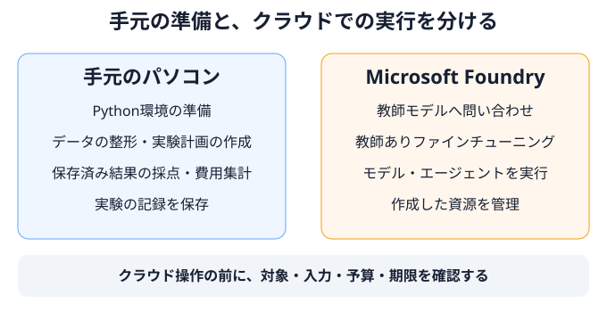

# 04 実験を始めるための環境と条件を準備する

## この章の目的

第1・2章では蒸留と評価の考え方を、第3章では題材となる小売業務を説明しました。この章では、それらを実践するために、**作業環境・比較条件・予算・停止条件**を準備します。

## 手元で行うことと、クラウドで行うことを分ける

この教材には、手元のパソコンで行う処理と、Microsoft Foundryへ接続して行う処理があります。まず、その違いを確認します。



保存済みのデータを整形したり、結果を集計したりする段階では、Azureへの接続は必要ありません。教師モデルへ新しい問い合わせを送る、追加学習する、クラウドでモデルやエージェントを動かす段階では、接続先と費用の確認が必要です。

最初に手元の環境を用意し、その後、クラウドで使う対象と実験条件を整理します。クラウドへ接続するための追加ライブラリや、エージェントの実行環境は、使う経路を決めてから準備します。

## 手元の実行環境を整える

### 教材をZIPでダウンロードして展開する

教材を取得するだけなら、Gitのインストールは不要です。

1. [リポジトリ](https://github.com/shitada/foundry-distillation-lab)をブラウザーで開き、ブランチが`main`になっていることを確認します。
2. **Code → Download ZIP**を選び、`foundry-distillation-lab-main.zip`を保存します。
3. ZIPを手動で解凍し、PowerShellで展開後の教材フォルダーへ移動します。

次のパスを、実際に解凍した場所に置き換えて実行してください。

```powershell
Set-Location -LiteralPath 'C:\work\foundry-distillation-lab-main'
```

移動先は、`README.md`、`pyproject.toml`、`scripts`が入っているフォルダーです。以降のコマンドは、この場所で実行します。

### 使用するPythonを確認する

本教材で確認に使用した環境は、Windows・PowerShell・Python 3.13です。パッケージの宣言上はPython 3.11以上ですが、ここでは確認した環境に合わせて進めます。

教材のフォルダーへ移動した状態で、使用するPythonを確認します。

```powershell
py -3.13 --version
```

Python 3.13が表示されれば、その版を使えます。見つからない場合は、[PythonのWindows向け公式案内](https://docs.python.org/3.13/using/windows.html)を確認して準備します。

### この実験用のPython環境を作る

他の作業で使っているライブラリと混ざらないよう、**仮想環境**を作ります。仮想環境は、このリポジトリ専用のPythonとライブラリを使い分ける仕組みです。

```powershell
py -3.13 -m venv .venv
.\.venv\Scripts\python.exe -m pip install -e .
```

最初の行は`.venv`というフォルダーに仮想環境を作り、次の行は、その環境へ教材のパッケージを導入します。ライブラリの取得にはインターネット接続が必要になる場合があります。既にこの教材用の環境を作っている場合は、その環境を使います。

以降の章でコマンド先頭に`python`とある場合も、`.\.venv\Scripts\python.exe`に置き換えて実行してください。この書き方なら仮想環境を有効化する操作は不要で、PowerShellの実行ポリシーを変更する必要もありません。

### 教材コードの動作を確認する

次に、ローカルで動くテストを実行します。

```powershell
.\.venv\Scripts\python.exe -m unittest discover -s tests
```

この教材向けに整備したテストで、データ処理・採点・費用計算などのコードが想定どおり動くかを確認します。失敗した場合は、その内容を確認してから先へ進みます。

## クラウドで使う対象を確認する

### 教師モデルと生徒モデルを選ぶ

本教材のもとになった筆者の小売サポート実験では、次のモデルを使用しました。

| 役割 | 使用したモデル |
|---|---|
| 教師モデル | `gpt-5.4-pro` |
| 学習前の生徒モデル | `gpt-4.1-nano`（`2025-04-14`版） |
| 学習済みの生徒モデル | 上記の生徒モデルを、教師の対応履歴で追加学習したもの |

これはモデル選択の一例です。実行する時点で利用しやすいモデルや、エージェントに任せる仕事によって、適した組み合わせは変わります。以下の観点を参考に、使用するモデルを選びます。

| 選ぶ対象 | 重視すること | 今回の小売サポートで見る点 |
|---|---|---|
| 教師モデル | 学習の手本にできる対応の品質 | 必要な確認を順に行い、正しいツールと引数を選び、結果を日本語で説明できるか |
| 生徒モデル | 追加学習への対応と、品質・待ち時間・費用のバランス | ツール呼び出しを含む教師ありファインチューニングに対応し、会話履歴とツール仕様を扱えるか。必要な品質へ近づけられそうか |
| 両者の組み合わせ | 置き換えを試す意味があること | 必要な品質を保ちながら、問い合わせ全体の待ち時間や、学習・配置も含めた総費用を減らせそうか |

教師には単に最も高価なモデルを、生徒には単に最も安価なモデルを選ぶのではなく、第3章の指示文とツールを使い、対象業務での振る舞いを確かめて選びます。教師が生成した履歴の品質と利用条件は第5章で確認します。生徒モデルが追加学習前から必要な品質を満たす場合は、そのまま使う選択もあります。

生徒モデルの学習・推論への対応状況と、配置時の具体的な確認方法は、[第6章の実践手順書](../how-to/06-training-and-evaluation.md#モデルとfoundryの準備)を参照してください。学習前後の比較には、同じ種類・版を追加学習する前と後のモデルを使います。

### 接続先と実行条件を確認する

クラウドでの作業は、対象を曖昧にしたまま始めないことが重要です。例えば、同じ名前のモデルが別のプロジェクトにもある場合、名前だけでは実行先を区別できません。

| 確認するもの | この実験で確認すること |
|---|---|
| Azureサブスクリプション | どの契約・課金先で実験するか |
| Foundryプロジェクト | どのプロジェクトを対象にするか |
| リージョン | どの地域で使うか。その地域で必要なモデル・学習機能を利用できるか |
| モデルとその版 | 教師モデル、生徒モデルの種類と版、呼び出す配置先 |
| 権限と利用枠 | 実行者に必要な権限があるか。学習や推論に必要な利用枠を確保できるか |
| 料金と保持時間 | どの料金区分を使い、作成したモデルや実行基盤をいつまで残すか |

**認証**は、誰として接続するかを確認することです。**権限**は、その接続先で何を操作できるかを定めます。この教材の接続コードでは、Azureの認証情報を取得する`DefaultAzureCredential`を使います。接続に必要な秘密情報を、本文や実行ログへ書き込む運用にはしません。環境に応じた認証方法は、[Microsoftの公式資料](https://learn.microsoft.com/azure/developer/python/sdk/authentication/overview)を確認してください。

また、手元から操作するプログラムと、クラウド上で動くホスト型エージェント（Hosted Agent）は、別の実行環境です。使うライブラリの組み合わせも分けています。手元側は[パッケージ設定](https://github.com/shitada/foundry-distillation-lab/blob/main/pyproject.toml)、エージェント側は[専用の依存ライブラリ一覧](https://github.com/shitada/foundry-distillation-lab/blob/main/deploy/hosted-agent/requirements.txt)を参照し、一つの環境へまとめて導入しないでください。

実際に利用できるモデル、地域、ライブラリの版は、クラウド実行へ進む時点で確認します。接続用ライブラリの導入と、実行経路ごとの詳しい手順は、[クラウド実行の参照資料](https://github.com/shitada/foundry-distillation-lab/blob/main/docs/reference/cloud-execution.md)にまとめています。

## 実験条件と判断基準をまとめる

ここまでに確認した環境と、第1〜3章で説明した業務・評価の考え方を、実験計画へまとめます。項目を一度に決めようとせず、「比較するもの」「判断する基準」「支出と実行管理」に分けて整理します。

### 比較するものを決める

| 決める項目 | 記録する内容 |
|---|---|
| 実験の問い | 学習による変化を知りたいのか、教師モデルの置き換えを判断したいのか |
| 比較対象と実行環境 | 教師モデル・学習前後の生徒モデルと各モデルの版。前節で確認したクラウド上の対象と配置先 |
| 共通の業務条件 | 業務ルール、指示文、ツール仕様、仮想業務日、ケースと初期状態 |
| 評価範囲と入力 | 問い合わせの種類、件数、繰り返す回数、実行順。ケースの版と使用する入力ファイル |

### 判断する基準を決める

| 決める項目 | 記録する内容 |
|---|---|
| 品質の基準 | 必須の確認、許される対応、重大な違反、成功の定義 |
| 許容する差 | 教師モデルと比べ、どの指標でどこまでの差を許容するか |
| 運用条件 | 許容待ち時間、想定する利用量・期間、必要な運用環境 |
| 採用後の費用条件 | 今後の運用費と、追加導入費をどの条件で比較するか |
| 確認方法 | 自動で確かめる項目、人が読む項目、確認担当者 |
| データ管理 | 各データの用途、最終評価用データの保管先と管理者 |

### 支出と実行管理を決める

| 決める項目 | 記録する内容 |
|---|---|
| 学習・評価への投資 | 期待する効果と追加学習の理由。データ生成・学習・評価・配置の保持費の見積り |
| 推論の予算と上限 | モデル別の問い合わせ件数、時間、処理する文章量（トークン数）、モデル・ツールの最大呼び出し回数、回復のための予備費 |
| 固定費と保持時間 | モデルの稼働、エージェント基盤、ツール・ログ・保存領域などの費用と保持時間 |
| 停止・保留・照合 | 費用・時間の上限、障害や証拠不足が起きた場合の扱い、送信前の記録、成否不明時の照合、再送禁止条件 |
| 所有リソース | この実験で作成した資源と、既存資源を区別した一覧 |
| 実行前の確認 | 対象・入力・呼び出し上限、学習・推論・保持費の見積りと終了予定 |

一件の問い合わせでモデルやツールを複数回呼ぶ場合があるため、問い合わせ件数と呼び出し回数は区別します。また、学習・評価へこれから投資する予算と、採用後に発生する運用費は別の項目です。第2章で整理した、学習前の投資判断と学習後の採用判断に対応させます。

この時点ですべての欄を埋める必要はありません。まだ決められない項目は「未定」とし、**誰が、何を確認し、どの操作の前に決めるか**を記録します。例えば、学習用ファイルは第5章でデータを準備してから確定します。

入力や業務仕様が途中で変わっていないかを確認するための内部識別値は、プログラムが自動記録します。利用者は手計算せず、保存した入力・設定とrunを実験計画に対応付けます。

### 実験計画と実行結果の保存方法

実験の条件と結果を対応付けて確認できるよう、計画・設定と、コードが出力したファイルを保存します。

| 用意するもの | 誰が用意するか |
|---|---|
| 実験の目的・判断基準、設定・費用見積り | 利用者が記入する |
| 整形したデータ、実行記録、評価結果、費用レポート | スクリプトが指定された保存先へ出力する |

本教材では、生成するファイルの保存先に`runs`フォルダーを使います。後の章のコマンドで出力先を指定すると、コードが必要なフォルダーとファイルを作成します。出力用フォルダーを先に作っておく必要はありません。

保存先の名前は利用者が指定します。別の実験では新しい出力先を使い、前の結果を残します。具体的な指定方法と生成されるファイルは、各実践章で説明します。

使用したPythonやライブラリの版、未定の項目と確認担当者など、コードの出力に含まれない記録は利用者が補います。環境ごとの設定や認証情報、生の実行記録は公開リポジトリへ追加しません。

## 実行する前に、今回の操作を確認する

計画の作成と、有料操作を始める判断は分けます。「この実験を行う」という合意だけで、すべての推論・学習・配置を続けて実行するのではありません。

操作の前に、**何を、どの対象と入力に対して、何件・いくらまで・いつまで実施するか**を確認します。実行に必要な項目が未定なら、その操作へは進みません。品質の合格基準や許容差も、本評価の結果を見る前に決めます。

実行前に、接続先・モデル・入力・呼び出し上限と費用見積りを確認します。入力・設定・サービスの受付記録はプログラムが保存します。設定例と操作は[クラウド実行の手順](../reference/cloud-execution.md)を参照してください。

## 途中で止まったときと、実験を終えるとき

### 結果が分からない場合は、すぐに送り直さない

通信が途中で切れた場合、手元で結果を受け取れなくても、クラウド側では処理が進んでいる可能性があります。そのまま送り直すと、同じ処理や支出が重なるおそれがあります。

送信前の記録はプログラムが残します。結果が不明なら、まず元の要求の状態を照合し、記録を削除したり実験名を変えたりして送り直さないでください。費用見積りと取得できた使用量・実費は分け、欠落を0と扱いません。

### 条件を変更するときは、変更前の記録を残す

入力、指示文、ツール、設定を変えると、比較条件も変わる場合があります。変更した内容と理由を記録し、別の実験版として扱います。結果が悪かったことを理由に、期待する答えや合格基準だけを変えてはいけません。

### 後片付けは、自分の実験で作った資源だけを対象にする

手元のプログラムを止めても、クラウド上の学習処理や配置済みモデルが残れば、費用が発生し続ける場合があります。作成した資源の一覧と保持期限を記録し、停止・削除の対象と結果を確認します。

対象は、この実験で作成したと確認できる資源に限定します。既存の教師モデルや他の実験の資源、保持すべき学習原本をまとめて削除しません。具体的な停止・照合・後片付けの扱いは、[安全な実行の参照資料](https://github.com/shitada/foundry-distillation-lab/blob/main/docs/reference/safety.md)で確認します。

## 完了条件

次の準備ができていれば、データ作成の章へ進みます。

- 教材用のPython環境を用意し、ローカルのテストを実行できる。
- 手元で行う処理と、クラウドへの接続が必要な処理を区別できる。
- 比較対象・判断基準・予算・停止条件を、一つの実験計画で管理できる。
- 未定の項目について、確認する人と、実行前に確定する段階が分かる。
- 実行前の費用確認、結果不明時の照合、所有する資源の後片付けの方針を説明できる。

## この章の範囲と限界

この章で行うのは、手元の環境づくりと実験条件の準備です。クラウドでの学習・推論・配置の実行は、後の章で扱います。現在の公開版では、それらを通した実環境での確認は済んでいません。

クラウドへ進む前には、認証・権限・モデル利用可否のほか、エージェントの通信仕様、使用するライブラリ、実行主体、記録の保存先を確認します。現行の予算・実行記録の管理は、複数の実行単位が同時に動く構成を前提にしていないため、クラウドでの追試でも、記録が再起動後に残る保存先と単一の実行単位が必要です。

また、呼び出しコマンドの内部で要求が再送されないか、作成・削除の条件付き操作がサービス側で想定どおり動くかも確認が必要です。共有資源へ実行する前に、これらの条件を満たしていることを確かめます。ライブラリの内部的な仕組み、コマンド引数、返却形式などの詳細は、[クラウド実行の参照資料](https://github.com/shitada/foundry-distillation-lab/blob/main/docs/reference/cloud-execution.md)へ分けて記載しています。

## リファレンス

1. **[Python公式ドキュメント — venv：仮想環境の作成](https://docs.python.org/3.13/library/venv.html)**

   実験用のPython環境を分離する仕組みと、仮想環境内のPythonを直接使う方法を参照。
2. **[Python公式ドキュメント — Using Python on Windows](https://docs.python.org/3.13/using/windows.html)**

   WindowsでPythonを準備する方法と、Pythonランチャーの説明を参照。
3. **[Microsoft Learn — Azure IdentityライブラリによるPythonアプリの認証](https://learn.microsoft.com/azure/developer/python/sdk/authentication/overview)**

   実行する環境に応じた認証方法と、開発者の認証・クラウド上の実行主体を区別する考え方を参照。
4. **[本教材のクラウド実行手順](https://github.com/shitada/foundry-distillation-lab/blob/main/docs/reference/cloud-execution.md)／[安全な実行の方針](https://github.com/shitada/foundry-distillation-lab/blob/main/docs/reference/safety.md)**

   使用するライブラリ、設定、実行記録、停止・照合・後片付けの具体的な条件を確認できます。
