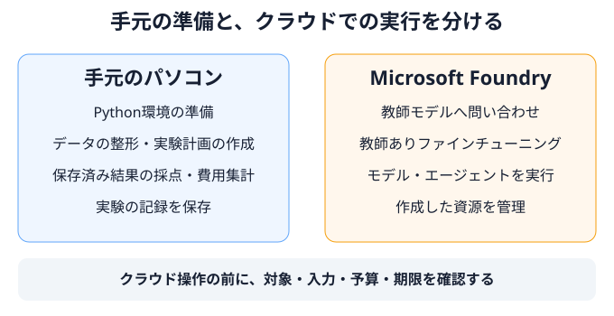

# 04 実験を始めるための環境と条件を準備する

## この章の目的

第1・2章では蒸留と評価の考え方を、第3章では題材となる小売業務を説明しました。この章では、それらを実践するために、**作業環境・比較条件・予算・停止条件**を準備します。

## 手元で行うことと、クラウドで行うことを分ける

この教材には、手元のパソコンで行う処理と、Microsoft Foundryへ接続して行う処理があります。まず、その違いを確認します。



保存済みのデータを整形したり、結果を集計したりする段階では、Azureへの接続は必要ありません。教師モデルへ新しい問い合わせを送る、ファインチューニングする、クラウドでモデルやエージェントを動かす段階では、接続先と費用の確認が必要です。

最初に手元の環境を用意し、その後、クラウドで使う対象と実験条件を整理します。クラウドへ接続するための追加ライブラリや、エージェントの実行環境は、使う経路を決めてから準備します。

## 手元の実行環境を整える

### 教材をZIPでダウンロードして展開する

教材を取得するだけなら、Gitのインストールは不要です。

1. [リポジトリ](https://github.com/shitada/foundry-distillation-lab)をブラウザーで開き、ブランチが`main`になっていることを確認します。
2. **Code → Download ZIP**を選び、`foundry-distillation-lab-main.zip`を保存します。
3. ZIPを手動で解凍し、PowerShellで展開後の教材フォルダーへ移動します。

次のパスを、実際に解凍した場所に置き換えて実行してください。

```powershell
Set-Location -LiteralPath 'C:\work\foundry-distillation-lab-main'
```

移動先は、`README.md`、`pyproject.toml`、`scripts`が入っているフォルダーです。以降のコマンドは、この場所で実行します。

### 使用するPythonを確認する

本教材で確認に使用した環境は、Windows・PowerShell・Python 3.13です。パッケージの宣言上はPython 3.11以上ですが、ここでは確認した環境に合わせて進めます。

教材のフォルダーへ移動した状態で、使用するPythonを確認します。

```powershell
py -3.13 --version
```

Python 3.13が表示されれば、その版を使えます。見つからない場合は、[PythonのWindows向け公式案内](https://docs.python.org/3.13/using/windows.html)を確認して準備します。

### この実験用のPython環境を作る

他の作業で使っているライブラリと混ざらないよう、**仮想環境**を作ります。仮想環境は、このリポジトリ専用のPythonとライブラリを使い分ける仕組みです。

```powershell
py -3.13 -m venv .venv
.\.venv\Scripts\python.exe -m pip install -e .
```

最初の行は`.venv`というフォルダーに仮想環境を作り、次の行は、その環境へ教材のパッケージを導入します。ライブラリの取得にはインターネット接続が必要になる場合があります。既にこの教材用の環境を作っている場合は、その環境を使います。

以降の章でコマンド先頭に`python`とある場合も、`.\.venv\Scripts\python.exe`に置き換えて実行してください。この書き方なら仮想環境を有効化する操作は不要で、PowerShellの実行ポリシーを変更する必要もありません。

### 教材コードの動作を確認する

次に、ローカルで動くテストを実行します。

```powershell
.\.venv\Scripts\python.exe -m unittest discover -s tests
```

この教材向けに整備したテストで、データ処理・採点・費用計算などのコードが想定どおり動くかを確認します。失敗した場合は、その内容を確認してから先へ進みます。

## クラウドで使う対象を確認する

### 教師モデルと生徒モデルを選ぶ

本教材で新しく実験を行う際は、次の組み合わせを標準にします。

| 役割 | 使用するモデル |
|---|---|
| 教師モデル | `gpt-5.5`（`2026-04-24`版） |
| 学習前の生徒モデル | `gpt-4.1-nano`（`2025-04-14`版） |
| 学習済みの生徒モデル | 上記の生徒モデルを、教師の対応履歴でファインチューニングしたもの |

実行する時点で利用しやすいモデルや、エージェントに任せる仕事によって、適した組み合わせは変わります。以下の観点を参考に、使用するモデルを選びます。

| 選ぶ対象 | 重視すること | 今回の小売サポートで見る点 |
|---|---|---|
| 教師モデル | 学習の手本にできる対応の品質 | 必要な確認を順に行い、正しいツールと引数を選び、結果を日本語で説明できるか |
| 生徒モデル | ファインチューニングへの対応と、品質・待ち時間・費用のバランス | ツール呼び出しを含む教師ありファインチューニングに対応し、会話履歴とツール仕様を扱えるか。必要な品質へ近づけられそうか |
| 両者の組み合わせ | 置き換えを試す意味があること | 必要な品質を保ちながら、問い合わせ全体の待ち時間や、学習・配置も含めた総費用を減らせそうか |

教師には単に最も高価なモデルを、生徒には単に最も安価なモデルを選ぶのではなく、第3章の指示文とツールを使い、対象業務での振る舞いを確かめて選びます。教師が生成した履歴の品質と利用条件は第5章で確認します。生徒モデルが学習前から必要な品質を満たす場合は、そのまま使う選択もあります。

生徒モデルの学習・推論への対応状況と、配置時の具体的な確認方法は、[第6章の実践手順書](../how-to/06-training-and-evaluation.md#モデルとfoundryの準備)を参照してください。学習前後の比較には、同じ種類・版をファインチューニングする前と後のモデルを使います。

### 接続先と実行条件を確認する

クラウドでの作業は、対象を曖昧にしたまま始めないことが重要です。例えば、同じ名前のモデルが別のプロジェクトにもある場合、名前だけでは実行先を区別できません。

| 確認するもの | この実験で確認すること |
|---|---|
| Azureサブスクリプション | どの契約・課金先で実験するか |
| Foundryプロジェクト | どのプロジェクトを対象にするか |
| リージョン | どの地域で使うか。その地域で必要なモデル・学習機能を利用できるか |
| モデルとその版 | 教師モデル、生徒モデルの種類と版、呼び出す配置先 |
| 権限と利用枠 | 実行者に必要な権限があるか。学習や推論に必要な利用枠を確保できるか |
| 料金区分 | 学習・推論・配置にどの料金区分が適用されるか |

**認証**は、誰として接続するかを確認することです。**権限**は、その接続先で何を操作できるかを定めます。この教材の接続コードでは、Azureの認証情報を取得する`DefaultAzureCredential`を使います。接続に必要な秘密情報を、本文や実行ログへ書き込む運用にはしません。環境に応じた認証方法は、[Microsoftの公式資料](https://learn.microsoft.com/azure/developer/python/sdk/authentication/overview)を確認してください。

標準手順では、手元のPythonからFoundryのモデルを呼び出し、業務ツールは手元で実行します。接続用ライブラリの導入と設定は、[第6章の実践手順](../how-to/06-training-and-evaluation.md)と[第7章の実践手順](../how-to/07-end-to-end-evaluation.md)に沿って進めます。

## 比較の条件を揃え、実行前に費用を確認する

学習の効果を確かめるには、同じ仕事を同じ基準で比べることが大切です。まずは教材に用意された業務条件・評価ケース・採点基準を使って進めます。

### 比較全体で揃えること

一組の比較では、指示文、ツール仕様、業務ルールと仮想業務日、問い合わせと初期状態、採点基準を共通にします。モデル別に生成設定を変える場合は、その違いも記録します。

独自のケースや採点基準を使う場合は、評価結果を見る前に決めます。結果が悪かったことを理由に、期待する答えや合格基準だけを変更してはいけません。

教材の採点結果と、実際の業務に採用できるかは別の判断です。採用まで検討する場合は、任せたい対応、許容できない誤り、必要な品質と待ち時間を、結果を見る前に決めて記録します。

実験に使う予算と、採用後の運用費も分けて考えます。第8章では、実験記録と公開料金から費用比較グラフを作ります。月間件数や表示期間はプログラムが選ぶため、ここで決める必要はありません。

業務ルールや問い合わせの傾向が変わると再評価や再学習が必要になる可能性があるため、その頻度と費用も運用前に見込んでおきます。

### 有料操作の前に確認すること

学習・評価・モデルの配置などを始める前に、各章の手順に沿って次の三点を確認します。

| 確認すること | 確認のポイント |
|---|---|
| 対象と入力 | 意図した接続先・モデル・入力ファイル・設定を使っているか |
| 実行量と費用 | 件数や呼び出し上限、採点用モデルも含む概算費用が、今回の予算に収まるか |
| 終了予定 | 処理の時間上限と、配置したモデルをいつまで保持するか |

一件の問い合わせでも、モデルを複数回呼ぶ場合があります。トークン数や呼び出し回数の制限は、金額の上限を保証しません。予算額で自動停止する前提にはせず、実行量と保持時間を確認します。

入力・設定・実行結果はプログラムが保存します。利用者は、独自に決めた判断基準や条件を変更した理由を補い、結果と一緒に残します。具体的な設定と保存先は、各実践章で説明します。環境ごとの設定や認証情報、生の実行記録は公開リポジトリへ追加しません。

## 途中で止まったときと、実験を終えるとき

### 結果が分からない場合は、すぐに送り直さない

通信が途中で切れた場合、手元で結果を受け取れなくても、クラウド側では処理が進んでいる可能性があります。そのまま送り直すと、同じ処理や支出が重なるおそれがあります。

送信前の記録はプログラムが残します。結果が不明なら、まず元の要求の状態を照合し、記録を削除したり実験名を変えたりして送り直さないでください。費用見積りと取得できた使用量・実費は分け、欠落を0と扱いません。

### 条件を変更するときは、変更前の記録を残す

入力、指示文、ツール、設定を変えると、比較条件も変わる場合があります。変更前の入力・設定・結果を残し、変更した内容と理由を記録して、別の実験版として扱います。

### 後片付けは、自分の実験で作った資源だけを対象にする

手元のプログラムを止めても、クラウド上の学習処理や配置済みモデルが残れば、費用が発生し続ける場合があります。作成した資源の一覧と保持期限を記録し、停止・削除の対象と結果を確認します。

対象は、この実験で作成したと確認できる資源に限定します。既存の教師モデルや他の実験の資源、保持すべき学習原本をまとめて削除しません。具体的な停止・照合・後片付けの扱いは、[安全な実行の参照資料](https://github.com/shitada/foundry-distillation-lab/blob/main/docs/reference/safety.md)で確認します。

## 完了条件

次の準備ができていれば、データ作成の章へ進みます。

- 教材用のPython環境を用意し、ローカルのテストを実行できる。
- 手元で行う処理と、クラウドへの接続が必要な処理を区別できる。
- 比較で共通にする条件と、結果を見る前に決める判断基準が分かる。
- 有料操作の前に、対象・入力・実行量・概算費用・終了予定を確認できる。
- 結果不明時の照合と、自分の実験で作った資源の後片付けの方針を説明できる。

## この章の範囲と限界

この章で行うのは、手元の環境づくりと実験条件の準備です。クラウドでの学習・推論・配置の実行は、後の章で扱います。現在の公開版では、それらを通した実環境での確認は済んでいません。

クラウドでの再送や、資源の作成・削除に関する制約は、[クラウド実行の参照資料](../reference/cloud-execution.md)にまとめています。共有資源を使う場合は、実行前にこれらの条件を確認します。

### 補足：Hosted Agentで実行する場合

標準手順とは別に、業務ツールもクラウド上で動かすHosted Agentを試す場合は、[専用の準備手順](../../deploy/hosted-agent/README.md)を参照してください。依存ライブラリは手元のPython環境と分け、通信仕様・実行権限・再起動後も残る記録の保存先を確認します。現在のテンプレートは単一の実行単位を前提としており、複数の実行単位を同時に動かす構成は検証していません。

## リファレンス

1. **[Python公式ドキュメント — venv：仮想環境の作成](https://docs.python.org/3.13/library/venv.html)**

   実験用のPython環境を分離する仕組みと、仮想環境内のPythonを直接使う方法を参照。
2. **[Python公式ドキュメント — Using Python on Windows](https://docs.python.org/3.13/using/windows.html)**

   WindowsでPythonを準備する方法と、Pythonランチャーの説明を参照。
3. **[Microsoft Learn — Azure IdentityライブラリによるPythonアプリの認証](https://learn.microsoft.com/azure/developer/python/sdk/authentication/overview)**

   実行する環境に応じた認証方法と、開発者の認証・クラウド上の実行主体を区別する考え方を参照。
4. **[本教材のクラウド実行手順](https://github.com/shitada/foundry-distillation-lab/blob/main/docs/reference/cloud-execution.md)／[安全な実行の方針](https://github.com/shitada/foundry-distillation-lab/blob/main/docs/reference/safety.md)**

   使用するライブラリ、設定、実行記録、停止・照合・後片付けの具体的な条件を確認できます。
