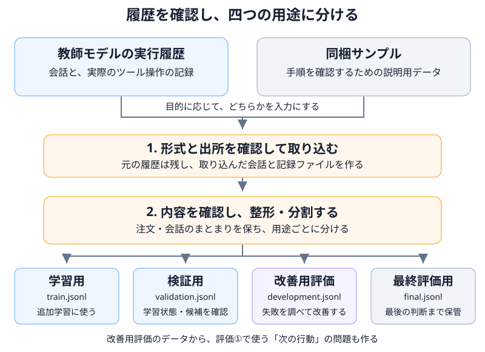

# 05 教師モデルの履歴を学習用データへ変える

## この章の目的

第3章で扱った小売サポートの実行履歴を、**生徒モデルの学習に使うデータと、評価に使うデータ**へ分けます。どの履歴を採用し、どう整形して、どのファイルを次の処理へ渡すかを確認します。

## 学習材料にするのは、回答だけでなく仕事の履歴

ツールの使い方を学ばせるには、顧客への最終回答だけでなく、途中で何を確認し、どのツールへ何を渡したかも必要です。この章では、一つの顧客入力から回答までを一会話として扱います。

例えば返品対応なら、顧客の依頼、モデルが出した注文照会の指示、そのツール結果、次の指示、最後の回答という履歴を使います。モデルが文章だけで「注文を確認した」と書いたものではなく、実際のツール呼び出しと結果を対応付けた記録を用意します。

作業には、次の二種類の入力データを使えます。

| 入力データ | 使う目的 |
|---|---|
| 実際の教師モデルから収集した会話履歴 | 今回の業務を学ばせるための材料を作る |
| 同梱の[サンプルデータ（traces.jsonl）](https://github.com/shitada/foundry-distillation-lab/blob/main/data/samples/traces.jsonl) | 手元で取り込み・整形・分割の手順を確認する |

同梱サンプルには、**作成用のプログラムと、作成済みのデータファイル**があります。

- [`scripts\generate_samples.py`](https://github.com/shitada/foundry-distillation-lab/blob/main/scripts/generate_samples.py)：架空店舗の配送問い合わせ20件分の会話データを作るプログラム。
- [`data\samples\traces.jsonl`](https://github.com/shitada/foundry-distillation-lab/blob/main/data/samples/traces.jsonl)：そのプログラムで作成したデータファイル。

**本章では、作成済みの`traces.jsonl`を使います。`generate_samples.py`を実行して作り直す必要はありません。** 次の「保存済みの履歴を取り込む」では、`collect.py`でこのデータを読み込みます。

実際の蒸留を行うときは、同梱サンプルではなく、内容を確認した教師モデルの履歴を入力にします。



以降のコマンドは、第4章で用意した仮想環境のPythonを使い、リポジトリのルートで実行します。出力先のフォルダーはコードが作成するので、先に手動で作る必要はありません。指定した出力先が既にある場合は、新しい名前を選び、後続の入力パスもそれに合わせます。

## 保存済みの履歴を取り込む

最初に`collect.py`で、保存済みの会話を読み込み、形式を確認して取り込みます。この操作はファイルを読み込むもので、教師モデルへ問い合わせる操作ではありません。

| 入力・出力 | この例で使うもの |
|---|---|
| 入力 | 同梱サンプルの`data\samples\traces.jsonl` |
| 出力先 | 新しい`runs\trace-import`フォルダー |
| 作成するファイル | 取り込んだ会話の`traces.jsonl`と、出所・件数などを記録する`collection-manifest.json` |

```powershell
.\.venv\Scripts\python.exe scripts\collect.py `
  --input data\samples\traces.jsonl `
  --format conversation `
  --output-dir runs\trace-import
```

`--format conversation`は、会話単位のデータを読み込む指定です。ファイルは、1行に1会話の構造化データを保存する形式（JSON Lines）で、次の情報を持ちます。

| 項目名 | 内容 |
|---|---|
| `conversation_id` | 会話を区別する識別名 |
| `category` | 配送・返品など、問い合わせの種類 |
| `messages` | 顧客・モデル・ツールの発言や操作を、順番に並べた履歴 |
| `tools` | 使用したツールの定義。省略時は教材の正本を使い、指定時は正本と照合する |
| `source_kind` | データの出所を示す区分 |

最初の三つは必須です。単なる問い合わせ文の一覧を、この会話形式として渡すことはできません。

取り込みが終わったら、`runs\trace-import\collection-manifest.json`を開き、取り込んだ会話件数を示す`conversations`を確認します。**今回入力した`traces.jsonl`には配送問い合わせ20件分の会話が入っているため、全件取り込まれた場合は`20`になります。** ここでは、入力した会話数と取り込まれた会話数が一致するかを確認しています。実際の教師モデルの履歴を使う場合も、そのファイルの会話数と照合します。

データの出所も入力ファイルから引き継がれ、この例では手順確認用のサンプルとして記録されます。

## 学習材料として使える内容かを確認する

形式が正しくても、誤った対応を学習の手本にしてよいわけではありません。実際の教師モデルの履歴を使う場合は、次の点を確認して採用する会話を選びます。

| 確認する点 | 具体的に見る内容 |
|---|---|
| 出所と利用条件 | どのモデル・業務条件で得た履歴か。学習や保存に利用してよいか |
| 業務上の正しさ | 必要な確認を行い、顧客の依頼と業務ルールに沿って対応しているか |
| 記録の対応 | ツールの呼び出しと結果が対応し、途中で欠けたり終了理由が不明になったりしていないか |
| 個人情報・機密情報 | 不要な情報が混ざっていないか。学習に使える状態か |
| 日本語と業務仕様の整合 | 説明が読めるか。注文・商品・理由・対応内容が、第3章の仕様と一致しているか |

教材の仮想業務日は**2026年8月31日**です。期限や遅延の判断も、この日付を基準に確認します。不正な操作をツールが拒否した履歴を、そのまま良い模範例として採用しないでください。

不完全な会話や不適切な例は、理由と件数を残して除外・保留します。元の履歴を直接書き換えず、修正が必要なら別の版として保存します。非公開の内部思考は、学習材料に含めません。

## 学習用と評価用に分ける

### 四つの用途を分ける理由

学習で見せた例と同じものだけを試しても、新しい問い合わせへ対応できるかは分かりません。そこで、データを次の用途に分けます。

| 用途 | 使い道 | ファイル |
|---|---|---|
| 学習用 | 生徒モデルへの追加学習に使う | `train.jsonl` |
| 検証用 | 学習中の状態確認や、学習済み候補の選択に使う | `validation.jsonl` |
| 改善用評価 | 失敗を調べ、学習データや指示文の改善を検討する | `development.jsonl` |
| 最終評価用 | 改善案と評価条件を固定した後、最終判断に使う | `final.jsonl` |

本来は評価だけに使う情報が、学習や候補選びへ入り込む問題を**データ漏洩**と呼びます。ファイル名を分けるだけでなく、同じ注文や会話、よく似た例が別の組へ混ざらないようにします。

### 整形・分割を実行する

`prepare_data.py`は、取り込んだ履歴を教材の形式に揃え、注文・会話のまとまりを保って分割します。ここでは、先ほど作ったファイルを入力にします。

| 入力・出力 | この例で使うもの |
|---|---|
| 入力 | `runs\trace-import\traces.jsonl` |
| 出力先 | 新しい`runs\data`フォルダー |
| 作成するファイル | 四用途のデータ、評価①の問題、整形・分割の記録 |

```powershell
.\.venv\Scripts\python.exe scripts\prepare_data.py `
  --input runs\trace-import\traces.jsonl `
  --output runs\data `
  --seed 42
```

`--seed 42`は、同じ入力から同じ分割を再現するための並べ替えの初期値です。この実装は最低10グループを必要とし、学習用60%、検証用15%、改善用評価15%、残りを最終評価用に割り当てます。グループの大きさと端数処理により、会話数の比率は変わることがあります。

同梱サンプルの20会話では、学習用12件、検証用3件、改善用評価3件、最終評価用2件になります。分割後は全体件数だけでなく、問い合わせの種類ごとの件数も確認します。このサンプルは配送照会だけなので、返品・交換などを含む実験用データは別に用意する必要があります。

### 処理結果を確認する

四用途のファイルに加え、次のファイルが`runs\data`へ作られます。

| ファイル | 何を確認するか |
|---|---|
| `normalized.jsonl` | 整形後の会話と、その出所 |
| `audit.json` | 行ごとの処理内容と、保留された場合の理由 |
| `manifest.json` | 分割した会話、種類別の件数、元入力と出力の識別値 |
| `next-actions.jsonl` | 改善用評価の会話から取り出した、評価①の問題 |

呼び出しと結果が対応しない、指定された業務仕様と異なる、不完全な会話が含まれるなどの場合、処理は停止します。`audit.json`が作られていれば、その理由を確認します。エラーになった行を黙って消したり、意味のある発言を機械的に削ったりして進めないでください。詳しい形式と処理の範囲は、[データ整形・分割の仕様](https://github.com/shitada/foundry-distillation-lab/blob/main/docs/reference/data-contract.md)に記載しています。

`manifest.json`の`quality_review_approved: false`は、整形・分割の処理が人による品質確認を代行していないことを示します。学習に採用する判断は、確認したファイルの識別値と、確認内容・担当者を対応付けて記録します。

同じ分割を再現できても、意味的に似た例の混入まで解決したとは限りません。言い換えや生成パターンの偏りも点検し、同一テンプレート由来のデータを、多様な実顧客の標本とみなさないようにします。

## 評価①で使う「次の行動」の問題を用意する

第2章で説明した評価①では、途中までの履歴を渡し、次に何をするかを確認します。そのために、改善用評価の会話から「ここまでの履歴」と「参照する次の行動」を取り出します。

この問題が`next-actions.jsonl`です。学習用や最終評価用ではなく、**改善用評価のデータだけ**から作ります。参照する行動は採点用に分けて保持し、モデルへ渡す履歴には含めません。

次のコマンドで、評価プログラムが読み込める入力ファイルへまとめます。

```powershell
.\.venv\Scripts\python.exe scripts\evaluate.py `
  --mode next-action `
  --prepare-next-actions `
  --input runs\data\next-actions.jsonl `
  --output runs\next-action-input.json
```

ここで作るのは問題と参照例のファイルです。モデルに問題を解かせるのは第6章なので、応答の記録欄`records`は空のままです。問題の準備と、モデルの応答生成・採点を分けて進めます。

会話との対応、ツール定義、参照行動、元ファイルの識別値は、この変換でも保持します。項目ごとの対応や入力形式は、[評価用ファイルの仕様](https://github.com/shitada/foundry-distillation-lab/blob/main/docs/reference/evaluation-contract.md)で確認できます。

## 最終評価用のデータを、改善に使わず残す

`final.jsonl`は、改善の途中では見ず、学習や候補選びに使いません。第4章の実験計画に、保管先、管理者、使う段階を記録します。

最終評価の結果を見てモデルや指示文を修正した場合、その評価は既に改善の材料です。独立した最終確認には、新しい未使用のデータと実験版を用意します。判断と記録の方法は第9章で扱います。

なお、最終評価用の会話ファイルを、そのまま業務全体の評価②へ渡すわけではありません。第7章では、顧客の依頼、初期状態、許容する対応をケースとして用意し、モデルに見せる情報と採点用の情報を区別します。

## 実際の教師モデルの履歴を使う場合

ここまでの例では、同梱のサンプルデータを取り込み、学習用と評価用に分けました。実際の蒸留では、この入力を教師モデルの対応履歴に置き換えます。

### 対応履歴をすでに持っている場合

顧客の依頼、モデルの応答、ツールの呼び出しと結果が揃っていることを確認します。その履歴を本教材の会話形式に整え、「保存済みの履歴を取り込む」で使った入力ファイルの代わりに指定します。

取り込み後は、サンプルと同じ流れで内容を確認し、整形・分割を進めます。

### これから対応履歴を作る場合

**最初に用意するのは、教師モデルへこれから送る問い合わせの一覧です。** 対応が終わった会話履歴ではなく、依頼文と、それを管理するための情報を用意します。

| 用意する情報 | 記入例 |
|---|---|
| 問い合わせを区別する名前 | `return-001` |
| 問い合わせの種類 | 返品 |
| 教師モデルに送る依頼文 | 注文ORD-0001のランニングシューズが破損していたので、返品して返金してください |

この一覧には、返品・交換・配送など、実験で扱いたい問い合わせを含めます。教師の回答や、実行するツールの結果を先に書く必要はありません。それらは、教師モデルに対応させたときに記録します。

次に、第3章で説明した指示文とツールを使うエージェントへ、問い合わせを送ります。実行前に、第4章で扱った接続先・件数・予算・期限・承認を確定します。

対応中は、顧客の依頼から最終回答までのモデルの応答、ツールの呼び出しと結果、終了理由、取得できた使用量を保存します。**この一連の記録が、前半で扱った「会話履歴」になります。**

保存した履歴を回収したら、必要な記録が揃っているか確認し、取り込み・整形・分割へ進みます。

問い合わせ一覧のファイル形式、実行コマンド、承認、履歴の保存・回収方法は、[教師モデルの呼び出し・履歴収集の手順](https://github.com/shitada/foundry-distillation-lab/blob/main/docs/reference/cloud-execution.md)を参照してください。

## 後続の章で使うファイルを確認する

第6章以降で使うファイルを、用途と合わせて確認します。コマンドへ直接渡すものと、分析や最終評価の準備で参照するものがあります。

| ファイル | 後続の用途 | 使用する章 |
|---|---|---|
| `runs\data\train.jsonl` | 生徒モデルの追加学習に使う | 第6章 |
| `runs\data\validation.jsonl` | 学習状態の確認と、学習済み候補の選択に使う | 第6章 |
| `runs\data\development.jsonl` | 改善用評価で失敗した場面について、元の会話を確認する際に参照する | 第6章 |
| `runs\next-action-input.json` | 評価①でモデルに与える問題と、採点用の参照例として使う | 第6章 |
| `runs\data\final.jsonl` | 改善には使わず、最終評価用ケースを準備するために保管する | 第7章 |

## 完了条件

次の内容を確認できれば、学習と評価①の章へ進みます。

- 教師モデルの履歴と、手順確認用のサンプルの違いを説明できる。
- 入力・出力の保存先と、コードが作成するファイルの役割が分かる。
- 学習・検証・改善用評価・最終評価のデータを分け、注文や会話の重複を点検できる。
- 保留・除外の理由、問い合わせの種類の偏りや不足を記録できる。
- 最終評価用データの保管先と管理者を決めている。

実際の学習へ進む前には、使用する教師履歴の内容と利用条件を確認し、入力ファイルとその確認結果を実験計画へ結び付けます。同梱サンプルで操作できたことと、実験用の教師データを準備できたことは分けて扱います。

## この章の範囲と限界

本章のコマンド例で行うのは、保存済みファイルの取り込み・整形・分割・評価入力の準備です。実際の教師モデルの呼び出しと記録取得は、現在の公開版ではクラウド上の通し確認が済んでいません。

実行する場合は、呼び出しコマンド内部の再送、返却形式、記録の保存・回収を確認してから進みます。プログラム側の再試行を止めても、起動した別のコマンドの内部まで止めたことにはなりません。エージェントの配置、再起動後も残る保存先や承認ファイルの用意、記録の回収も自動では完結しません。呼び出しが返ったことと、必要な履歴を取得できたことを区別します。

また、形式検査だけで業務上の正しさや個人情報の混入をすべて判断することはできません。実データへ置き換えるときは、内容の確認と利用条件の確認を行います。

## リファレンス

1. **[同梱サンプルの説明](https://github.com/shitada/foundry-distillation-lab/blob/main/data/samples/README.md)**

   入力例の作り方と用途を確認できます。
2. **[本教材のデータ整形・分割の仕様](https://github.com/shitada/foundry-distillation-lab/blob/main/docs/reference/data-contract.md)**

   入力形式、自動で行う整形、停止条件、分割と出力の仕様を確認できます。
3. **[本教材の評価用ファイルの仕様](https://github.com/shitada/foundry-distillation-lab/blob/main/docs/reference/evaluation-contract.md)**

   次の行動の問題を評価入力へ変換する方法と、参照例・モデルの応答の扱いを確認できます。
4. **[本教材のクラウド実行・履歴収集の手順](https://github.com/shitada/foundry-distillation-lab/blob/main/docs/reference/cloud-execution.md)**

   収集計画、呼び出し、承認、履歴の形式、未検証の実行条件を確認できます。
5. **[scikit-learn — Common pitfalls: Data leakage](https://scikit-learn.org/stable/common_pitfalls.html#data-leakage)**

   学習や候補選びに評価用の情報を混入させない、一般的な原則を参照しています。
