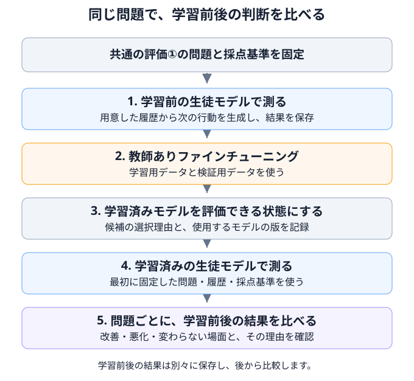

# 06 追加学習で、次の判断がどう変わったかを確かめる

## この章の目的

第5章で用意したデータを使い、**教師ありファインチューニング**の前後で、生徒モデルの判断がどう変わったかを調べます。第2章の評価①を使って、同じ場面でのツール選択や、ツールへ渡す情報を比較します。

この章では、実験の流れと結果の考え方を説明します。Foundryの操作、設定ファイルの作成、実行コマンドは、[第6章の実践手順書](../how-to/06-training-and-evaluation.md)にまとめています。

## 学習前に測り、学習後も同じ問題で測る

学習済みのモデルだけを試しても、追加学習で改善したのか、もともとできていたのかは分かりません。まず学習前の結果を保存し、学習後に同じ問題と採点基準で測ります。

第2章の図は、一つのモデルに対して評価①を行う方法を示していました。この章では、その評価を**学習前と学習後の二つの時点で実施**し、保存した結果を比較します。

## 評価の仕組みと、準備するもの

この章では、手元の評価プログラムから、Foundryに配置したモデルを直接呼び出します。モデルには指示文を含む会話履歴とツール仕様を渡し、返ってきた「次のツール呼び出し、または回答」を採点します。

例えば配送状況の問い合わせなら、「注文照会ツールを選び、正しい注文番号を指定できるか」を確認します。

筆者の実験では、生徒モデルに`gpt-4.1-nano`を使用しました。この章では、同じ種類・版の生徒モデルについて、教師の対応履歴で学習する前と後を比較します。モデルの選び方は、[第4章の「教師モデルと生徒モデルを選ぶ」](04-environment.md#教師モデルと生徒モデルを選ぶ)を参照してください。

モデルを呼び出せる配置先、接続先、認証を準備します。準備方法は、[実践手順書の「接続先・設定・認証を準備する」](../how-to/06-training-and-evaluation.md#1-接続先設定認証を準備する)を参照してください。

第5章から引き継ぐファイルは次のとおりです。

| ファイル | この章での用途 |
|---|---|
| `runs\data\train.jsonl` | 生徒モデルへの追加学習に使う |
| `runs\data\validation.jsonl` | 学習中の状態確認に使う |
| `runs\next-action-input.json` | 評価①で使う問題と、採点用の参照例 |
| `runs\data\development.jsonl` | 失敗した場面の元の会話を確認する際に参照する |

**参照例**とは、モデルの応答を採点するときに比べる、期待するツール呼び出しや回答です。教師モデルの履歴を元にしていても、正しいとは限りません。評価を始める前に業務ルールと照合します。同梱サンプルを使う場合は、教師の実測ではなく説明用データである点も区別します。

データは第5章で分けた用途に従って使い、`final.jsonl`は最終評価のために保管します。

## 学習前の生徒モデルを評価する

追加学習を始める前に、比較の基準となる応答を取得します。用意した各問題を学習前の生徒モデルへ渡し、その応答とルール検査結果を保存します。採点用モデルによる内容の評価は、学習後の応答が揃ってからまとめて行います。

各問題は、用意された会話履歴から独立して始めます。これにより、同じ条件で「その場面の次の判断」を比較できます。

実行後は、すべての問題を試せたか、通信エラーや出力の欠落がないかを確認してから、モデルの判断を読みます。応答を取得できなかった問題と、応答は取得できたが判断が誤っていた問題を混同しないようにします。

操作は、[実践手順書の「学習前の生徒モデルを評価する」](../how-to/06-training-and-evaluation.md#2-学習前の生徒モデルを評価する)に記載しています。入力・応答・ルール検査の結果は自動保存され、学習後と比較する基準になります。

## 教師ありファインチューニングを行う

学習前の評価を終えたら、学習用と検証用のデータで追加学習します。処理は、次の三段階に分かれます。

| 段階 | 行うこと | 確認する結果 |
|---|---|---|
| 手元での準備 | データの形式を確認し、入力・設定を保存する | データの件数、学習対象、設定 |
| ファイルのアップロード | 学習用・検証用のファイルをFoundryの学習サービスへ渡す | ファイルが受け付けられ、処理を終えたこと |
| 学習の実行 | アップロードしたファイルを指定し、追加学習を依頼する | 学習処理の状態、学習中の指標、学習済みモデル |

これらは一つの開始コマンドで順に実行します。学習用・検証用の両ファイルの処理完了を待ってから、学習を1回依頼します。実行前に学習量と単価から支出を見積もります。

学習には、第5章で内容を確認し、整形・分割したデータを使います。

学習方法と状態の確認は、[実践手順書の「学習を開始し、状態を確認する」](../how-to/06-training-and-evaluation.md#3-学習を開始し状態を確認する)を参照してください。

## 学習済みモデルを評価できる状態にする

学習が終わったら、学習ジョブから返された学習済みモデルの識別子を確認し、そのモデルを配置します。

学習の効果は、学習前よりも正しいツールを選び、必要な情報を渡せるようになったかで確かめます。学習済みモデルを配置し、学習前と同じ問題で応答を比較します。

**学習済みモデルの識別子**は「どのモデルができたか」を示し、**配置名**は「推論時にどの呼び出し先を指定するか」を示します。両者の対応を記録します。配置には学習とは別の費用が発生する場合があるため、保持する期間も決めておきます。

操作は、[実践手順書の「学習済みモデルを選んで配置する」](../how-to/06-training-and-evaluation.md#4-学習済みモデルを選んで配置する)に記載しています。

## 学習後も、同じ評価①で測る

学習前に固定した問題、履歴、指示文、ツール仕様、採点基準を、そのまま使います。呼び出すモデルを学習済みモデルへ変更し、別の保存先へ応答とルール検査結果を記録します。

生成する文章量の上限や配置方式も揃え、同じ条件で学習前後を比較します。

操作は、[実践手順書の「学習後の生徒モデルを評価する」](../how-to/06-training-and-evaluation.md#5-学習後の生徒モデルを評価する)を参照してください。共通の問題と設定を使い、モデル指定と保存先だけを変えます。

## 問題ごとに、何が変わったかを確認する

合計の成績だけでなく、改善した問題、悪化した問題、変わらなかった問題を確認します。

| 観点 | 比較すること |
|---|---|
| ツール選択 | 必要なツールを選んだか。不要な操作を要求していないか |
| ツールへ渡す情報 | 注文・商品などの値、必須項目、形式、型が適切か |
| 確認・終了の判断 | 必要な情報を確認するか、適切なところで回答を終えるか |
| 日本語の回答 | 期待する場面で本文を返し、内容を正しく説明しているか |

採点は、ツール名・引数などのルール検査と、採点用モデルによる内容の評価を組み合わせます。学習前後に同じ採点用モデルの設定と採点基準を使い、採点用モデルには評価対象のモデル名や学習前後の区別を渡しません。ルール検査で見つかった失敗は、採点用モデルの判定で合格に変えません。

自動採点と比較表の作成を実行し、最後の比較表で応答・参照例・判定・理由を読みます。操作は[実践手順書の比較](../how-to/06-training-and-evaluation.md#6-自動採点して前後を比較する)を参照してください。

自動判定は、採点用モデルが採点基準に照らして出した推定です。利用者は実際の応答と判定理由を読み、結果を確認します。採点結果の`rows`には問題ごとの判定と理由、`per_model`と`per_case`には集計があります。

比較結果では、学習前後の応答、参照例、判定理由、使用量、時間、未試行やエラーを確認します。返品・交換・配送などの種類別にも確認し、代表的な失敗例を残します。費用見積りと、取得できた使用量・実費は分けて記録します。

失敗した問題の前後関係を調べるときは、`runs\data\development.jsonl`で元の会話を確認します。

一つの会話から複数の問題を取り出すため、問題数と元の会話数を分けて示します。

## 評価②へ進むために残すもの

| 残すもの | 用途 |
|---|---|
| 学習に使ったデータ・設定・アップロードと完了の記録 | どの条件で学習したかを確認する |
| 学習済みモデルの識別子と配置名 | 後の比較で同じモデルを使う |
| 学習前後の評価入力・応答・採点結果 | 同じ問題で判断がどう変わったかを確認する |
| 問題別・種類別の比較と失敗例 | 次に詳しく調べる点を整理する |

評価①で判断が改善しても、一件の問い合わせを最初から適切に扱えるかは別の問いです。第7章では、教師モデルと学習前後の生徒モデルに同じ業務を任せ、その過程と結果を比べます。

得られた結果と、次の評価で確認したいことを整理します。

## 完了条件

- 学習前の評価結果と、学習に使ったデータ・設定を記録している。
- 学習済みモデルの識別子と、評価に使った配置名が分かる。
- 同じ問題と採点基準で、学習前後の応答を比較できる。
- 改善だけでなく、悪化、未試行、エラー、未確認の内容も説明できる。
- 最終評価用データを、学習や候補選びに使っていない。
- 評価①で分かったことと、評価②で確かめることを分けられる。

実験後の記録保管と資源の整理は、[実践手順書の後片付け](../how-to/06-training-and-evaluation.md#7-記録を保管して後片付けする)を参照してください。

実装の確認状況と評価範囲の詳細は、[確認記録](../reference/verification.md)と[評価仕様](../reference/evaluation-contract.md)を参照してください。

## リファレンス

1. **[第6章の実践手順書](../how-to/06-training-and-evaluation.md)**

   Foundryの準備、接続設定、学習前評価、追加学習、学習後評価、後片付けを操作順に説明します。
2. **[本教材の評価仕様](../reference/evaluation-contract.md)**

   評価①・②の入力形式、自動採点、必要な場合の人による確認、実行上の制約を参照できます。
3. **[本教材のクラウド実行仕様](../reference/cloud-execution.md)**

   学習・配置・収集のコマンドと保存する記録、実装上の制約を参照できます。
4. **[Microsoft Learn — ファインチューニングの考慮事項](https://learn.microsoft.com/azure/foundry/openai/concepts/fine-tuning-considerations)**

   教師ありファインチューニングが適する用途、データ品質、費用などの考慮事項を参照できます。
