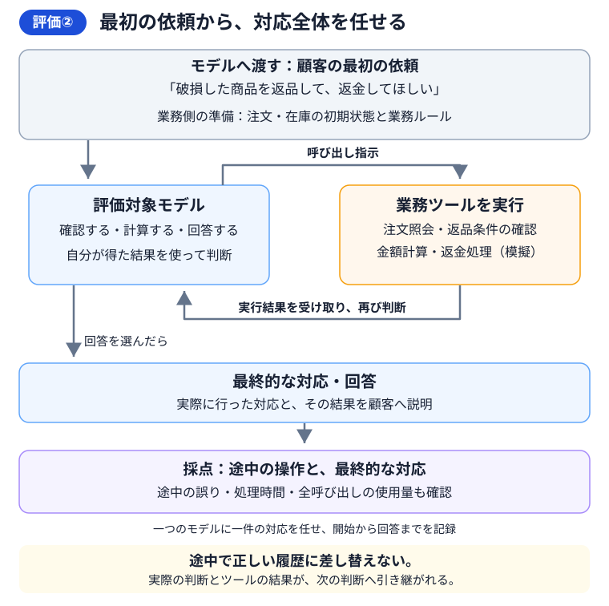

# 07 問い合わせへの対応全体を、三つのモデルで比較する

## この章の目的

第6章では、同じ会話履歴を与えたときに、生徒モデルの次の判断が学習前後でどう変わったかを調べました。この章では、**顧客の最初の依頼から、ツールを使って回答を返すまでの対応全体**を比べます。第2章で説明した評価②です。

比較するのは、**教師モデル・学習前の生徒モデル・学習済みの生徒モデル**です。対応の正しさ、処理時間、使用量を調べ、第8章の費用比較へつなげます。

この章では、評価の進め方と結果の読み方を説明します。設定、問い合わせの準備、実行、自動採点は、[第7章の実践手順](../how-to/07-end-to-end-evaluation.md)にまとめています。

## 第6章から、何が変わるのか

評価②では、モデルが必要なツールの呼び出しを指示します。ツールが実行されると、モデルはその結果を受け取り、次の操作や回答を選びます。この繰り返しを、最後の回答まで進めます。

例えば「破損した商品を返品して、返金してほしい」という依頼なら、次のような対応を確認します。

1. 注文と商品の情報を調べる。
2. 返品・返金の条件を確認する。
3. 条件に合う返金額を計算し、教材内の返金処理を行う。
4. 処理した内容を日本語で説明する。

注文番号が分からない依頼では、注文番号を尋ねることが適切な到達点です。**その依頼に対して、必要な処理または確認質問まで進めたか**を評価します。

使うのは、第3章で紹介した架空店舗の注文・在庫と業務ツールです。各問い合わせは同じ初期状態から始まり、一件の対応の中では、モデルの判断とツールの結果を次の判断へ引き継ぎます。

## 三つのモデルに同じ仕事を任せる

第4章で選んだ教師モデルと、第6章で評価した学習前後の生徒モデルを使います。

| 比べる組み合わせ | 確かめたいこと |
|---|---|
| 学習前の生徒モデルと、学習済みの生徒モデル | 学習によって、一件の対応全体がどう変わったか |
| 教師モデルと、学習済みの生徒モデル | 教師の対応をどこまで再現でき、時間と使用量がどう変わったか |
| 教師モデルと、学習前の生徒モデル | 学習前の生徒モデルが、どこまで対応できていたか |

学習前の生徒モデルも残すことで、教師との差と、学習による変化を分けて確認できます。

三つのモデルには、同じ問い合わせ、注文・在庫、業務ルール、指示文、ツール仕様、採点基準を使います。生成する文章量、モデルやツールを呼び出す回数、待機時間の上限も共通にします。教材内の業務日は**2026年8月31日**です。

これらを揃えたうえで、実際に選んだツール、呼び出した回数、かかった時間の違いを測ります。

## 評価する問い合わせと、期待する対応を用意する

この章では、配送・返品・返金・交換などの業務ルールに基づいた、教材の比較用の問い合わせを用意します。準備コマンドが第5章のデータを読み、そこで使った注文と重ならない注文を選びます。

これらは対応の違いや改善点を調べるための共通問題です。最終評価用に保管したデータとは分けて扱います。

一件の問い合わせについて、次の内容を揃えます。

| 用意するもの | 例 |
|---|---|
| 顧客の依頼 | 破損した商品の返品と返金を希望している |
| 最初の業務状態 | 対象の注文、商品、配送状況、在庫 |
| 必要な確認と処理 | 注文照会、返品条件の確認、金額計算、返金処理 |
| 期待する結果 | 正しい注文・商品の返金額を処理し、その内容を説明する |

配送状況の照会、返品、交換、情報不足、対応条件を満たさない依頼など、業務の種類ごとに評価する問い合わせを用意します。期待する対応は、第3章の業務ルールに基づいて決めます。

評価する問い合わせの入力形式は、[評価仕様の「評価②」](../reference/evaluation-contract.md#評価②-保存済みイベント)を参照してください。

## 対応の過程と結果を保存する

三つのモデルに同じ問い合わせを渡し、回答まで進めます。モデルごとに、次の情報を保存します。

| 保存する情報 | 後で確認すること |
|---|---|
| ツールを呼び出した順序 | 必要な照会や条件確認を経て処理したか |
| ツールへ渡した情報と実行結果 | 注文・商品・金額などが正しいか |
| 最後の処理結果と回答 | 依頼に合った対応を終え、内容を正しく伝えたか |
| 処理時間 | 回答を返すまでにどれくらい待つか |
| 全モデル呼び出しの使用量 | 一件の対応にどれくらいの文章処理が必要だったか |

評価プログラムがこれらを自動保存します。呼び出し先は、第6章で使った`runs\evaluation-config.json`の`targets`に設定します。教師モデルは`teacher`、学習前の生徒モデルは`base`、学習済みの生徒モデルは`fine_tuned`に対応します。

標準の保存先は`runs\e2e`です。その中に教師・学習前・学習後の記録を分けて保存します。実行方法は、[実践手順の「対応を実行し、自動採点と比較表を作る」](../how-to/07-end-to-end-evaluation.md#3-対応を実行し自動採点と比較表を作る)を参照してください。

## 自動採点して、比較表を読む

第6章と同じく、**自動採点と比較表の作成を行い、利用者が最後の比較表を読みます。** 採点用モデルには、`runs\grading-config.json`の設定と、教材に組み込まれた共通の採点基準を使います。

| 採点する内容 | 採点する方法 |
|---|---|
| 必要なツール・引数・実行順序 | プログラムで業務ルールと照合する |
| 許可された操作と処理結果 | プログラムで期待する結果と照合する |
| 回答の正しさ、説明や確認質問の適切さ | 採点用モデルが依頼・業務ルール・実行結果を読んで判定する |

例えば、注文と返金額は正しくても、「返金処理をした」という説明と、実際のツール実行結果が一致しているかまで確認します。必要な確認質問がある依頼では、何を尋ねたかも採点します。

比較表では、学習前後の改善・悪化に加え、教師と生徒の応答の違いを読みます。三つのモデルを並べた表は`runs\e2e\comparison.csv`です。判定理由と実際の操作を照らし合わせ、どの場面で差が出たかを確認します。

**自動採点の合格は、採点用モデルによる推定です。** 利用者は、合格・不合格・判断保留のそれぞれから代表例を選び、依頼に合った対応になっているかを読みます。

### 重大な違反は、件数と内容を確認する

別の注文への返金、顧客が希望していない処理、確認していない結果の説明などは、特に注意して確認する項目です。

例えば、10件のうち9件を正しく処理していても、1件で別の注文に返金していれば、その問題を解消する必要があります。全体の成績とあわせて、**重大な違反の件数と具体的な内容**を示します。

不適切な操作をモデルが要求したこと、ツールが止めたこと、実際に実行されたことは、それぞれ分けて記録します。

## 時間と使用量を比べる

処理時間は、顧客の依頼を渡してから回答を受け取るまでを測ります。途中のモデル呼び出しとツール実行の時間を含みます。

結果を見るときは、測定できた件数と、**中央値**、**95パーセンタイル**を確認します。中央値は真ん中の速さ、95パーセンタイルは約95%の測定結果が収まる待ち時間の目安です。

使用量は、一件の対応で行ったすべてのモデル呼び出しを合計します。入力、出力、再利用された入力を分けて記録します。同じ依頼でも、照会や判断を何度繰り返すかによって使用量は変わります。

**対応の正しさと、時間・使用量を組み合わせて読みます。** 例えば、学習後にツールの呼び出し回数が減ったら、必要な処理を保ったまま効率がよくなったのかを、実行結果で確かめます。

採点用モデルの使用量と時間は、問い合わせに対応したモデルの記録と分けて保存します。

## 評価できた件数と、結果が分からない件数を示す

結果をまとめるときは、予定した件数、実行できた件数、自動採点の合格・不合格・保留の件数を併記します。通信などの問題で応答を取得できなかった件数も残します。

例えば100件を予定し、80件の対応を実行、そのうち60件が自動採点で合格したなら、「予定100件、実行80件、自動採点の合格60件」と示します。残る20件の採点結果と、未実行20件の理由も確認します。

使用量や時間を取得できなかった項目は「不明」として記録します。比較表では`null`と表示されます。

## 評価結果を保存し、費用の比較へ進む

自動採点の保存先は、結果フォルダーの中の`teacher-graded`、`base-graded`、`fine_tuned-graded`です。

三つのモデルの採点結果と、処理時間・使用量の記録を保存します。

[第8章](08-cost.md)では、この記録とモデルごとの料金を使い、問い合わせ一件あたりの費用や、学習にかかった費用を含む総費用を比較します。

| 引き継ぐもの | 第8章での用途 |
|---|---|
| 同じ問い合わせに対する三つのモデルの結果 | 同じ仕事を任せた場合の費用を比べる |
| 一件の対応全体の使用量 | モデルごとの単価を使って推論費を計算する |
| 自動判定、理由、実行できた件数 | 品質と評価範囲を踏まえて費用を読む |
| モデルの種類・版・配置方式 | 使用量に対応する料金を確認する |
| 採点用モデルの使用量 | 実験にかかった評価費用を計算する |

自動判定による比較と、人が確認した業務成功は区別して記録します。第8章では、この違いも踏まえて費用と採用判断の根拠を整理します。

## 完了条件

- 同じ問い合わせと業務条件で、三つのモデルを評価している。
- 必要な操作、処理結果、日本語の回答を自動採点し、比較表の代表例を読んでいる。
- 改善・悪化した場面と、重大な違反の内容を説明できる。
- 処理時間、使用量、実行件数、判定保留や未実行の件数を確認できる。
- 第8章へ渡す三つのモデルの採点結果と、使用量の記録が揃っている。

## リファレンス

1. **[第2章：蒸留の効果をどう確かめるか](02-measurement.md)**

   評価①と評価②の違い、品質・時間・費用を採用判断へつなげる考え方を説明しています。
2. **[第7章の実践手順](../how-to/07-end-to-end-evaluation.md)**

   設定と問い合わせの準備、三つのモデルによる対応、自動採点と比較表の読み方を参照できます。
3. **[本教材の評価仕様](../reference/evaluation-contract.md)**

   問い合わせの入力形式、実行コマンド、採点と集計の仕様を参照できます。
4. **[本教材の確認記録](../reference/verification.md)**

   実装の確認状況と、確認した範囲を参照できます。
