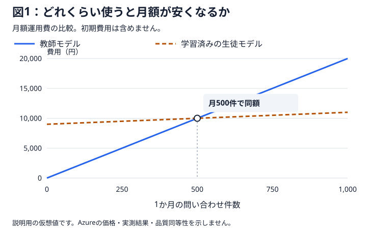
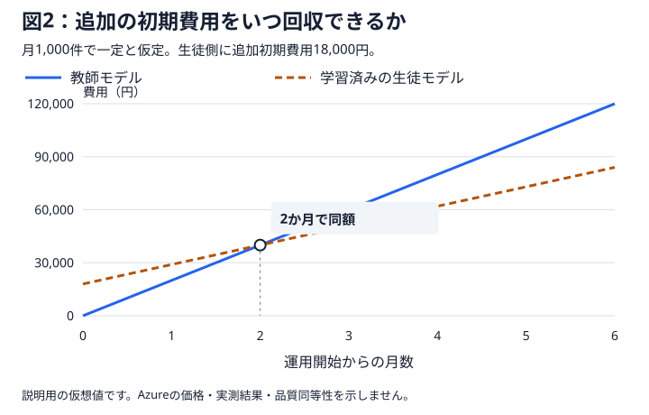

# 08 今回の実験結果から、費用比較グラフを作る

## この章の目的

第7章では、教師モデル・学習前の生徒モデル・学習済みの生徒モデルに同じ問い合わせを任せ、対応の品質、時間、使用量を調べました。この章では、その記録と公開料金から、**ラボの最終成果物となる費用比較グラフ**を自動生成します。

確かめるのは、次の三つです。

| 知りたいこと | 比べる費用 |
|---|---|
| 一件の問い合わせにいくらかかるか | 対応全体の推論費と、処理ごとに発生する費用 |
| 利用量によって、どのモデルが安くなるか | 月間問い合わせ件数を変えた月額費用 |
| 学習にかけた費用をいつ回収できるか | 複数の利用量における、初期費用を含む累積費用 |

第1章の説明用の例を、今回の使用量と選んだモデルの料金で計算し直す段階です。品質と待ち時間は第7章の結果を引き継ぎ、費用とあわせて読みます。

この章の費用は、**公開されている単価と実験の使用量に基づく概算**です。通貨はUSD（米ドル）です。モデルの推論・学習・評価・ホスティング費を反映します。運用時の配置は既定で1日24時間、追加費用は0として計算し、この二つだけ必要に応じて変更できます。

## 三つのモデルの評価結果を統合する

第7章の結果を、後述する費用計算コマンドが自動で統合します。`runs`フォルダーから最後に開始した評価を選び、その三つのモデルの使用量を、今後の一件あたり費用の見積もりに使います。

初期費用には、その評価と同じ実験に結び付く教師データ生成・学習・評価・自動採点の記録を集めます。再実行した費用も集計し、同じ応答の記録は一回分として計上します。集計対象は出力の`inventory.json`と`cost-ledger.json`に残ります。

## 費用を三つに分ける

推論の単価が安くても、モデルの配置を維持する費用や、学習・評価の費用を含めると比較結果が変わります。次の三つを分けて整理します。

| 費用の種類 | 含めるもの | 増え方 |
|---|---|---|
| 一件ごとの費用 | 問い合わせに対応するモデルの推論、ツールやログ保存などの従量費 | 問い合わせ件数に応じて増える |
| 月額固定費 | モデルの配置や、運用に必要な基盤を維持する費用 | 想定した稼働時間・構成に応じてかかる |
| 初期費用 | 教師の対応履歴の生成、学習、初回の評価、導入準備 | 運用前の準備としてかかる |

教師モデル、学習前の生徒モデル、学習済みの生徒モデルについて、それぞれの費用を整理します。この教材では、比較のための評価・採点費を三つの構成へ均等に配分し、教師データ生成費と学習費を学習済みモデルの初期費用に計上します。任意で入力する追加費用は、学習済みモデルの導入・運用に追加で必要な費用として計上します。

### 自動採点の費用も、評価費用に含める

第6章・第7章では、応答を読む採点用モデルも呼び出しました。この使用量は、各採点先の`grading.json`に保存されています。

初回の評価費用には、**評価対象モデルを動かした費用と、採点用モデルで採点した費用の両方**を含めます。顧客の問い合わせに対応する運用費と、実験のための評価費用を分けて計上します。

## 対応全体の使用量を料金に換算する

モデルが処理する文章量は、トークンという単位で記録されます。一件の問い合わせでモデルを何度も呼んだときは、その使用量をすべて合計します。

| 使用量 | 料金に換算する方法 |
|---|---|
| 通常の入力 | 入力トークン数から再利用分を引き、通常の入力単価を掛ける |
| 再利用された入力 | 再利用分のトークン数に、その入力単価を掛ける |
| 出力 | 出力トークン数に、出力単価を掛ける |

再利用された入力は、入力トークン数の一部です。料金表の単位が100万トークンあたりなら、使用量もその単位に合わせて計算します。

第7章の記録を使うことで、注文照会から最後の回答までにかかった推論費を見積もれます。失敗した対応で消費した使用量も含めます。過去の使用量にも取得時点の公開単価を適用し、同じ料金条件で比較します。

## グラフを自動生成する

プログラムが記録から費用を計算し、利用件数や期間を変えたグラフを作ります。**表示範囲と、累積費用に使う代表的な月間件数は自動で選び、図に明記します。**

### 1. 標準の条件でグラフを作る

第6章でログインしたアカウントを使います。PowerShellを開き、リポジトリのルートフォルダーで次のコマンドを実行します。実験記録の統合、配置情報と公開単価の取得、計算、グラフ生成までを行います。

```powershell
.\.venv\Scripts\python.exe scripts\report.py --estimate
```

保存先は`runs\cost-report`です。再実行すると`runs\cost-report-002`のように新しい保存先を作り、画面に表示します。

### 2. 作成されたグラフを開く

表示された保存先の**`graphs.md`**を開きます。今回の記録に基づく月額費用と、初期費用を含む累積費用のグラフをまとめて読めます。初期費用、月額固定費、一件あたりの費用の内訳は`costs.csv`にあります。

図の金額は今回の記録から計算した概算です。図に示す月間件数と期間は、比較のためにプログラムが選んだ条件です。情報が足りない費用は不明として残し、`estimate.md`に理由を表示します。

### 追加費用やホスティング時間を変える

人件費などを加味したい場合や、将来のホスティング時間の想定を変えて比較したい場合は、設定例を複製します。

```powershell
Copy-Item configs\examples\cost-plan.json runs\cost-plan.json
```

`runs\cost-plan.json`を開き、必要な項目だけ変更します。

```json
{
  "additional_initial_cost": 0,
  "additional_monthly_cost": 0,
  "hosting_hours_per_day": 24
}
```

| 項目 | 記入する内容 |
|---|---|
| `additional_initial_cost` | 学習済みモデルの導入に追加でかかる人件費など。単位はUSD、既定は0 |
| `additional_monthly_cost` | 学習済みモデルの運用に追加でかかる月額費用。単位はUSD、既定は0 |
| `hosting_hours_per_day` | 将来の運用で課金対象の配置を維持する時間。1日0〜24時間、既定は24 |

モデル費用は公開単価から自動計算します。追加費用欄には、人件費など、利用者が補う費用を入力します。既定値の0で作るグラフは、これらの追加費用を計上する前の概算です。

ホスティング時間は、グラフで想定する将来の稼働時間です。変更した値は将来の月額・累積費用の見積もりに反映します。実験中の保持費は配置の記録から計算し、Azure上の稼働時間は実際の配置・削除操作で管理します。

設定を保存し、次のコマンドでその条件のグラフを作ります。

```powershell
.\.venv\Scripts\python.exe scripts\report.py --estimate --config runs\cost-plan.json
```

新しい保存先の`graphs.md`を開き、変更前のグラフと比べます。

## 月額費用が逆転する利用件数を調べる

月額費用は、**一件ごとの費用に月間問い合わせ件数を掛け、月額固定費を加えて**求めます。

一件ごとの費用が安い生徒モデルでも、固定費がかかる構成では、利用が少ない間は教師モデルの方が安くなることがあります。利用件数を増やしたときに両者の月額が等しくなる点が、月額費用の分岐点です。

第1章の例で確認します。以下は計算の考え方を示す仮想値で、両モデルが必要な品質を満たすと仮定しています。

| 説明用の条件 | 教師モデル | 学習済みの生徒モデル |
|---|---:|---:|
| 一件ごとの費用 | 20円 | 2円 |
| 月額固定費 | 0円 | 9,000円 |

この条件では、月500件で両者の月額が10,000円になります。月1,000件なら教師モデルは20,000円、生徒モデルは11,000円です。



今回の結果では、生成された`volume.svg`を読み、**何件くらいから、どのモデルが安くなるか**を確認します。分岐点がある場合は、その前後が見える範囲をプログラムが選びます。

## 追加の初期費用を回収する期間を調べる

次に、データ生成・学習・評価などにかかった初期費用を含めます。生徒モデルを使うための追加初期費用を、教師モデルと比べた毎月の節約額で割ると、回収に必要な期間の目安になります。

先ほどの月1,000件の条件では、毎月9,000円の節約です。生徒モデルの追加初期費用が18,000円なら、2か月で回収します。



**月額が安くなる利用件数と、初期費用を回収する期間は別の指標です。** 月額の節約が見込めても、利用予定が回収期間より短ければ、初期費用を含む総額では教師モデルの方が安い場合があります。

生成された`payback.svg`では、複数の月間件数を条件に、初期費用込みの累積費用を並べます。各図の件数・期間を確認し、利用量によって回収の速さがどう変わるかを読みます。計算できる回収点が表示範囲外の場合も、その旨を示します。

三つのモデルの初期費用と月額を並べ、学習前の生徒モデルが必要な品質を満たしていたかも、第7章の結果と照らして確認します。

## 作成した表とグラフを読む

費用計算では、主に次の出力を確認します。

| 出力ファイル | 読み取ること |
|---|---|
| `graphs.md` | ラボの最終成果物。費用グラフと計算条件をまとめたページ |
| `costs.csv` | 三つのモデルの一件ごとの費用、月額固定費、初期費用、自動で選んだ代表件数での月額 |
| `volume.svg` | 月間問い合わせ件数を変えたときの月額と分岐点 |
| `cumulative.svg` | 自動で選んだ代表件数で、運用費が時間とともにどう積み上がるか |
| `payback.svg` | 複数の月間件数における、初期費用を含めた総額と回収までの期間 |
| `report.json` | 費用の内訳、計算結果、判断を保留している理由 |
| `estimate.md` | 概算の条件、対象の実験、情報が不足している項目 |
| `prices.json` | 使用した公開単価と取得元 |
| `cost-ledger.json` | 各実行の費用と、構成ごとの配分 |
| `graph-plan.json` | 自動で選んだ利用件数・表示範囲と、その選択根拠 |

`cumulative.svg`は運用費の累積、`payback.svg`は初期費用を含む累積です。どの費用を含めた図かを確かめて読みます。

料金や使用量が分からない項目は「不明」として残ります。表では空欄、計算結果のファイルでは`null`です。合計を読むときも、費用が揃っている範囲を確認します。実験中のホスティング費は、取得できた配置の作成時刻と保持時間から概算します。

自動採点の結果を使った費用比較は、評価した問い合わせに基づく見積もりです。「成功した対応一件あたりの費用」は、業務上の成功を人が確認した記録が揃った段階で算出します。確認待ちの間は保留として表示します。

## グラフから、今回分かったことを整理する

月額費用の図から、利用が少ないときと多いときに有利なモデルを確認します。累積費用の図から、初期費用がどの程度影響し、利用量によって回収期間がどう変わるかを確認します。

分岐点の有無も実験の結果です。教師モデルや学習前の生徒モデルが安い条件も含め、今回の品質と費用の関係を説明できることがラボの到達点です。

## 品質と費用から、次の展開を考える

第9章では、ここまでの結果から蒸留が役立つ条件をまとめます。期待した結果が得られなかったときの選択肢や、複数のモデルで仕事を分担する構成へ考えを広げます。

すでに支払った学習・評価費は、今回の投資全体を振り返るための記録です。**これまでにかかった費用と、これから使い続けるための費用を分けて**、どの構成を採用するか考えます。

## 完了条件

- 今回の実験記録と公開料金に基づく月額・累積費用グラフを生成している。
- 三つのモデルを同じ利用件数の条件で比較し、図に記載された前提を説明できる。
- 一件ごとの費用、月額固定費、初期費用を分けて説明できる。
- 月額費用の分岐点と、初期費用の回収期間を区別できる。
- 使用した料金・使用量・運用条件と、不明な項目が分かる。
- 第7章の品質・時間の結果と合わせ、どの条件で費用面の利点があるかを説明できる。

## リファレンス

1. **[第1章：蒸留と目的](01-introduction.md)**

   月額費用の分岐点と、追加初期費用の回収を説明する例を参照できます。
2. **[第7章：問い合わせへの対応全体を比較する](07-end-to-end.md)**

   費用計算の基になる、対応全体の品質・時間・使用量を説明しています。
3. **[費用計算の入出力仕様と図表](../../examples/illustrative/README.md)**

   設定項目、計算式、実行コマンド、出力ファイルの詳細を参照できます。
4. **[評価結果から費用入力を作る方法](../reference/evaluation-contract.md#評価②から第8章の費用入力へ接続する)**

   三つのモデルの結果を統合し、費用計算へ接続する操作を参照できます。
5. **[公開単価による自動概算の仕様](../reference/cost-estimation.md)**

   実験記録の対応付け、料金の選び方、初期費用の配分、不明値の扱いを参照できます。
