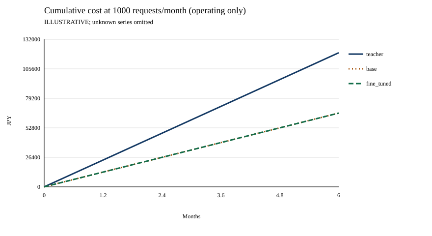
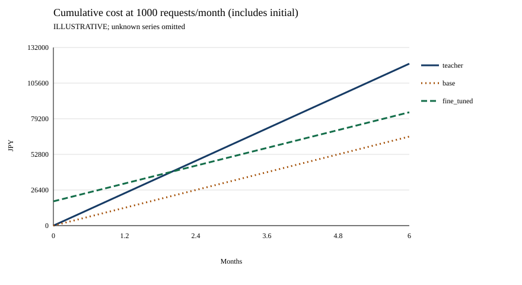

# 費用計算の説明用入力と図表

ここにある数値は**すべて架空の説明用値**です。Azureの現行料金・旧実験の観測値・新しい追試結果ではありません。品質の測定値もありません。そのため成功単価は未定義、判断ドラフトは保留です。

## 3枚の図を読み分ける


`volume.csv`：teacherは20円/件、base/fine_tunedは2円/件＋月9,000円です。500件ならどちらも10,000円、1,000件なら20,000円と11,000円です。baseとfine_tunedの線は重なります。実線＝teacher、点線＝base、破線＝fine_tunedで、色以外でも区別します。



`cumulative.csv`：月1,000件を維持したときの**運用費だけ**を累積します。初期費用を含めないため、すべて原点から始まります。



`payback.csv`：fine_tunedにのみ追加初期費用18,000円を置きます。teacher比の節約は月9,000円なので2か月で累積40,000円となり同額、3か月目以降に初期投資込みで安くなります。baseにはその初期費用を置かないため、同じ推論費でもfine_tunedと累積額は異なります。

| 月 | teacher運用累積 | student運用累積 | fine_tuned初期込み |
|---:|---:|---:|---:|
| 0 | 0 | 0 | 18,000 |
| 1 | 20,000 | 11,000 | 29,000 |
| 2 | 40,000 | 22,000 | 40,000 |
| 3 | 60,000 | 33,000 | 51,000 |

品質が同じという意味ではありません。baseが必要品質を満たせば、SFTしない方が良い可能性があります。

## 再生成

リポジトリルートで実行します。

```powershell
python scripts\report.py --input examples\illustrative\cost-input.json --output runs\cost-example
```

公開用の`assets`は同じ入力・同じレポーターで生成したスナップショットです。`runs`とは分離します。再生成の差分を確認するときは新しいrun先を指定して比較し、既存出力を上書きしません。日時やランダム値を出力に含めないため同じ入力から同じ表・図を生成できます。

## 入力スキーマ v1（集計済みJSON）

これは評価runnerの生出力形式ではありません。traceや請求書は直接読み込まず、利用者が証跡を検査・集計するか、下記の限定adapterで保存済み採点reportから準備します。全金額は**同じ通貨**、token単価は**100万token当たり**です。為替換算や価格自動取得はありません。

| フィールド | 意味・制約 |
|---|---|
| `schema_version` | `1` |
| `evidence_kind` | `illustrative`または`actual`。自己申告ラベルで検証証明ではない |
| `scenario` | 用途・条件の説明 |
| `currency` | 非空文字列。例`JPY` |
| `monthly_requests` | 0以上の月間顧客要求数。カテゴリ加重の予測なら小数可 |
| `horizon_months` | 0～1200の整数。需要・単価を一定とする月数 |
| `variants` | `teacher`、`base`、`fine_tuned`のちょうど3者 |

各variantは次の項目を持ちます。費目を省略した場合も`null`と同じ「不明」です。

| フィールド | 意味 |
|---|---|
| `inference_mode` | `per_request`または`tokens` |
| `prices.per_request` | `per_request`方式の要求当たり推論費。全呼出し・失敗・回復を含む |
| `prices.input_per_million` | `tokens`方式の非cache入力単価 |
| `prices.cached_input_per_million` | cache入力単価 |
| `prices.output_per_million` | 出力単価 |
| `usage_per_request.input_tokens` | 1顧客要求に属する全呼出しの入力token平均。cache分を含む |
| `usage_per_request.cached_input_tokens` | 入力tokenの内数。入力総数を超えてはいけない |
| `usage_per_request.output_tokens` | 全呼出しの出力token平均 |
| `variable_fees_per_request.agent` / `.tools_logs_storage` | 要求当たりの推論以外の変動費 |
| `monthly_fixed.model_hosting` / `.agent` / `.tools_logs_storage` | 月額固定費。変動費と同じ費目を二重計上しない |
| `initial.generation` / `.training` / `.evaluation` / `.other` | 一度だけの初期費用。比較対象ごとの配賦を記録 |
| `quality.review_complete` | 全対象の人間レビューが完了した場合のみ`true` |
| `quality.reviewed_requests` / `.successful_requests` | 0以上の整数または`null`。成功数はレビュー数以下 |
| `quality.quality_gate` | `pass` / `fail` / `unreviewed`。事前基準と証跡が別途必要 |
| `source` | usage/品質の証跡、価格URL・取得日・モデル/version・tier/region・単位、カテゴリ比、稼働時間、条件hash |

未知の価格・usage・費目は`null`です。実際に非該当だと確認した費目のみ`0`にします。数値文字列、負数、NaN、Infinityは拒否されます。JSONの余分な説明メタデータは保持できますが、任意の追加費目は計算されません。定義済み費目へ配賦し、根拠を`source`に残します。

`tokens`方式は「非cache入力×入力単価＋cache入力×cache単価＋出力×出力単価」を100万で割ります。cacheを入力総数と別途加算しません。usageや単価の一つでも不明なら推論費は不明です。cache量が0と既知でも、未知単価を自動で0補完しない保守的仕様です。

実測用の[テンプレート](../../configs/examples/cost-actual-template.json)は意図的に欠測を含みます。`actual`の例であって、実測完了を主張しません。対応するusage・価格・レビュー証跡を埋めるまで総費用は`null`のままです。公開前に機微なIDや生ログの参照を取り除いてください。

## 出力の意味

- `input.json`：再現用入力。秘密情報は入れない。
- `report.json`：費目別と合計、teacherとの比較、判断ドラフト。未知は`null`。
- `costs.csv`：3者の要求単価、固定費、初期費用、月額、成功率、予測成功単価。不明セルは空欄。
- `volume.csv/svg`：月額費用と月間要求数。初期費用は除く。
- `cumulative.csv/svg`：指定月間件数で運用費だけを累積。
- `payback.csv/svg`：初期費用込みの累積費用。
- `decision.md`：採用 / 条件付き / 見送り / 保留の記入用。自動決定はしない。

`projected_cost_per_reviewed_success`は月額を「月間要求数×レビューで観測した成功率」で割った**予測成功単価**です。初期費用は償却しません。レビュー未完了、成功0件、要求0件では未定義。代表的でないレビュー標本から将来の成功単価を推定してはいけません。

`crossover_requests`はstudentの変動費が安く、固定費が同額以上のときの運用分岐件数です。等額になる数学上の件数であり、品質の合格点ではありません。変動費が高いstudentは増量による節約分岐を返しません（少量だけ安い場合は各月額を読む）。同額費用や節約なしでは回収期間を返しません。初期費用が不明でも運用分岐は計算し、回収は不明とします。

`payback_months`はteacherより余分にかかる初期費用を月間節約額で回収する連続月数、`payback_whole_months`は切り上げた月数です。追加初期費用がなければ節約が正のとき0。割引率、税、段階料金、需要増減は扱わず、条件を変えた別入力で感度分析します。

## 評価レポートから費用入力を準備する

```powershell
python scripts\evaluate.py --mode e2e --input data\samples\evaluation-e2e.json --output runs\e2e-scores.json
python scripts\report.py --prepare-evaluation --input runs\e2e-scores.json --config configs\examples\cost-evaluation.json --output runs\evaluation-cost-input.json
python scripts\report.py --input runs\evaluation-cost-input.json --output runs\evaluation-cost-report
```

新規出力だけを許すオフライン変換です。`--config`は必須で、3者のtoken単価、agent/tool/logの変動費、hosting等の固定費、初期費用、月間要求数・期間・通貨は明示的に設定します。サンプルは価格を意図的に`null`にし、現在のAzure料金や支出承認を含みません。

入力は`mode=e2e`の`retail-evaluation-report-v1`で、teacher/base/fine_tunedの3者を揃えます。別々に実行した記録は同じケース・ツール・条件でオフライン再採点してから渡してください。rowsと`overall`/`per_model`の分母、状態件数、`usage_total`、`usage_known_subtotal`、`usage_reported_n`の不一致は拒否します。

| 変換 | 契約 |
|---|---|
| 分母・条件 | 各modelの全予定枠。失敗・未記録も含む。`case_id`の出現回数と`case_sha256`/`tool_contract_sha256`で3者のcohort・条件一致を確認 |
| token平均 | 完全観測された合計÷分母。項目ごとに欠測なら`null`。cacheは入力の内数 |
| 既知小計 | 監査用に保存するが、総量や費用平均の代替にはしない |
| 業務成功 | `status: confirmed_success`、`confirmed_business_success: true`、`deterministic_checks_passed: true`と、行の`evidence_sha256`に結び付いたfreshな成功`review`をすべて要求。未確認なら成功件数を確定せず、`source_review`を自動適用しない |
| 評価① | 顧客要求全体ではないため入力を拒否。`mode=e2e`のみ受け付ける |
| runtime | 行の`origin`と`provenance.runtime.kind`を照合して保持。`local_tool_loop`だけの注入runnerは実推論の証拠ではなくunknown。local/Hostedとも明示的metadataを要求し、設定から推測しない |
| カテゴリ | 観測カテゴリ比を捏造しない。均等な予定枠でのみ平均し、実運用比へ自動再重み付けしない |
| 証跡 | 元report・設定bytesのSHA256、元evidence kind、行provenance、分母、cohort、未知状態を保存 |

`evaluation_projection`の必須項目:

- `weighting: "uniform_scheduled_slots"`：均等な予定枠以外はこのadapterの対象外。
- `expected_runtime`：`local_direct_model`、`foundry_hosted_agent`、または`unknown`。観測の代わりではなく比較の前提。
- `production_category_mix`：未知なら`null`。指定する場合はカテゴリ名→比率のobjectで合計1。ただしカテゴリ別usageがないため再重み付けには使わない。
- `production_equivalence_reviewed`：運用との同等性レビュー有無を明示するboolean。`true`でも本番実行の証拠を生成するわけではない。

出力の`evaluation_bridge`に監査結果と保留理由を残します。case/tool/recordのhashがない旧reportや、cohort・case/tool条件・runtimeが異なる/不明な比較は、`status: evaluation_evidence_not_comparable`で分岐点・回収期間を出しません。レビューのhash一致はローカルmetadataの整合確認であり、reviewerの本人認証や署名検証ではありません。観測数が少ない、用途が違う、カテゴリが不明といった問題を、計算できたという理由で無視しません。

合成・由来不明の評価を`actual`設定で実測へ格上げできません。reportの最上位が実測と書かれていても、**1行でもprovenanceの`evidence_kind` / `source_evidence_kind`が合成または未知なら**説明用/保留として扱います。local推論をHosted Agentの測定へ付け替えません。出力は常に`production_evidence: false`を保持し、図にも`EVALUATION COHORT ONLY; NOT PRODUCTION`を付記します。公開した3枚の架空導入図はこのadapterで変更せず、従来の`cost-input.json`から再現します。
